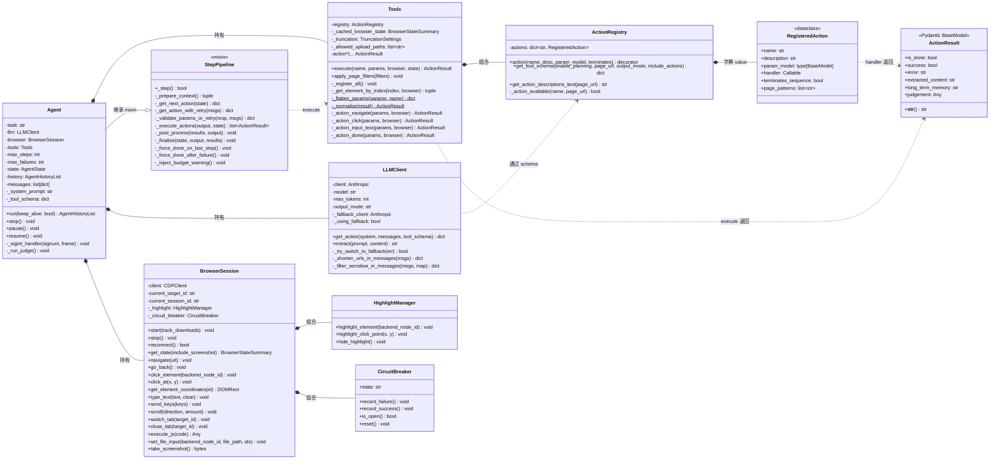
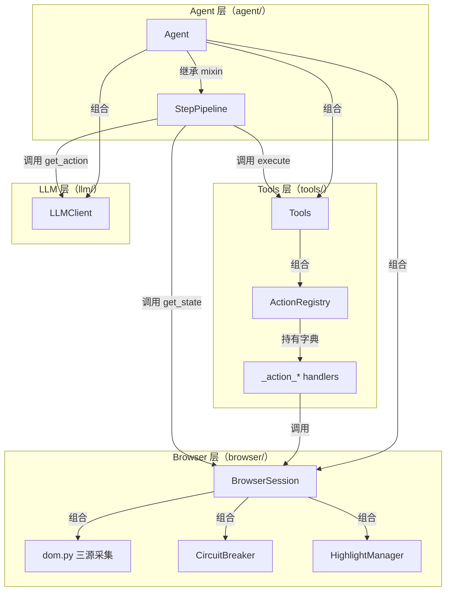

# 01 类图与模块结构

> 本章展示 TreeWalker Tools 子系统及其周边核心类的静态结构关系，配合 `tools/` 目录文件清单，建立心智模型后再深入动态行为。

---

## 1.1 核心类图



**类图说明**：

- **`Agent` 通过 mixin 模式继承 `StepPipeline`**：`Agent` 只负责"持有外部依赖 + 主循环控制（暂停/停止/信号）"，所有 5 阶段 step 逻辑由 `StepPipeline` 提供。这是 browser-use 风格的设计，避免单类过大。
- **`Tools` 是「执行引擎 + 注册中心持有者」**：内部组合一个 `ActionRegistry` 实例，外部世界（`Agent`）通过 `Tools.execute()` 这一个入口路由到 24 个 handler。
- **`RegisteredAction` 是隐式的 Tool 接口**：用 dataclass 描述元数据 + `Callable` 字段保存 handler。没有抽象基类，靠"约定签名 `async (params, browser) -> ActionResult`"约束所有 handler。
- **`ActionResult` 是唯一的统一返回类型**：跨 24 个 handler、跨 `_normalize`、跨 `_get_element_by_index` 都用同一个 Pydantic 模型。
- **`BrowserSession` 是单类巨石**：865 行覆盖连接 / 导航 / 交互 / Tab / JS / 文件 / 截图所有职责。没有 Browser/Context/Page/Tab 的层级抽象，Tab 信息只是 `TabInfo` 数据类。

---

## 1.2 `tools/` 目录文件清单

| 文件 | 行数 | 主要导出 | 职责一句话 |
|---|---|---|---|
| `__init__.py` | 11 | `ActionRegistry`, `RegisteredAction`, `Tools` | 包入口，对外只暴露 3 个符号 |
| `models.py` | 199 | 24 个 `*Params` Pydantic 类 + `ACTION_DEFINITIONS` | **声明层**：定义每个 action 的参数 schema 和元数据 |
| `registry.py` | 189 | `ActionRegistry`, `RegisteredAction` | **注册中心** + **Anthropic schema 工厂** |
| `actions.py` | 506 | `Tools` | **执行引擎** + 24 个 `_action_*` handler |

注意：项目中**没有** `tool.py` / `base_tool.py` / `tool_manager.py` 这类常见命名的文件。所有"工具"相关概念都被压缩到 4 个文件里。

---

## 1.3 关键类职责详解

### `Tools`（执行引擎 + 注册器持有者）

源码：[`src/tree_walker/tools/actions.py:110-505`](../../src/tree_walker/tools/actions.py)

`Tools` 类承担三个职责：

1. **持有 `ActionRegistry` 实例**：构造时通过 `_register_all()` 把 24 个 handler 反射注册进去
2. **暴露 `execute()` 作为唯一执行入口**：被 `Agent._execute_actions()` 调用
3. **辅助元素查找**：`_get_element_by_index()` 通过缓存的 `BrowserStateSummary` 快速定位 DOM 节点，避免每次 action 都重新采集状态

构造函数（[actions.py:117-122](../../src/tree_walker/tools/actions.py)）：

```python
def __init__(self, truncation=None, allowed_upload_paths=None) -> None:
    self.registry = ActionRegistry()
    self._register_all()
    self._cached_browser_state = None
    self._truncation = truncation or TruncationSettings()
    self._allowed_upload_paths = allowed_upload_paths
```

注意 `self.registry` 是 `Tools` 内部**唯一**的注册中心；外部 `Agent` 通过 `agent.tools.registry.get_tool_schema()` 访问它，等价于直接访问 schema 工厂。

### `ActionRegistry`（注册中心 + Schema 工厂）

源码：[`src/tree_walker/tools/registry.py:26-188`](../../src/tree_walker/tools/registry.py)

`ActionRegistry` 是无状态的服务类，对外提供四个核心 API：

| 方法 | 输入 | 输出 | 用途 |
|---|---|---|---|
| `action()` | name/description/param_model/terminates | 装饰器 | 把 handler 注册成 `RegisteredAction` 存入字典 |
| `get_tool_schema()` | enable_planning/page_url/output_mode/include_actions | dict | 生成 Anthropic `tool_use` 格式的 `agent_response` 工具 schema |
| `get_action_descriptions_text()` | page_url | str | 生成系统提示词中人类可读的 action 清单 |
| `_action_available()` | name/page_url | bool | 基于 URL glob 过滤判断 action 是否可用 |

### `RegisteredAction`（隐式 Tool 接口）

源码：[`src/tree_walker/tools/registry.py:16-23`](../../src/tree_walker/tools/registry.py)

```python
@dataclass
class RegisteredAction:
    name: str
    description: str
    param_model: type[BaseModel]
    handler: Callable[..., Awaitable[ActionResult | str | None]]
    terminates_sequence: bool = False
    page_patterns: list[str] | None = None
```

**没有抽象基类**：所有 handler 靠约定签名 `async (params: dict, browser: BrowserSession) -> ActionResult | str | None` 约束。`Tools._normalize()` 负责把 `str` / `None` 都包装为 `ActionResult`。

### `ActionResult`（统一返回类型）

源码：[`src/tree_walker/agent/views.py:8-37`](../../src/tree_walker/agent/views.py)

```python
class ActionResult(BaseModel):
    display_max_chars: ClassVar[int] = 500

    is_done: bool = False
    success: bool | None = None
    error: str | None = None
    extracted_content: str | None = None
    long_term_memory: str | None = None
    judgement: Any | None = None

    @model_validator(mode='after')
    def validate_success_requires_done(self):
        if self.success is True and self.is_done is not True:
            raise ValueError(
                'success=True can only be set when is_done=True. '
                'For regular actions that succeed, leave success as None.'
            )
        return self
```

关键约束：`success=True` 只能与 `is_done=True` 同时出现。普通成功 action 不设置 `success` 字段（保持 `None`）。

`__str__()` 输出格式（用于下一轮 LLM 上下文的 `[Previous Action Results]` 块）：

- `ActionResult(error="...")` → `"ERROR: ..."`
- `ActionResult(extracted_content="...")` → `"EXTRACTED: ...(截断到500字符)"`
- `ActionResult(is_done=True, success=True)` → `"DONE (success=True)"`
- `ActionResult()` → `"OK"`
- 多字段同时存在时用 `" | "` 连接

---

## 1.4 「无 Tool 基类」设计哲学

TreeWalker **故意不**定义 `Tool` 抽象基类。这与 LangChain / CrewAI / OpenAI Function Calling 等主流框架不同，他们通常要求每个工具继承 `BaseTool` 并实现 `_run()`。

### 设计权衡

| 维度 | 传统 BaseTool 模式 | TreeWalker 扁平模式 |
|---|---|---|
| **代码组织** | 每个 Tool 一个文件 | 所有 handler 集中在 `actions.py` |
| **类型约束** | 抽象方法 + 类型注解 | Python 约定 + Pydantic 运行时校验 |
| **新增成本** | 创建新类 + 继承 + 实现 + 注册 | 加一个 `_action_*` 方法 + 一条 `ACTION_DEFINITIONS` 记录 |
| **Schema 同步** | 容易忘写 description | 强制 `Field(description=...)` |
| **跨工具共享状态** | 需要依赖注入或全局变量 | 通过 `self`（handler 是 `Tools` 实例方法）直接访问 `_cached_browser_state` / `_truncation` / `_allowed_upload_paths` |

### 注册的关键代码

`Tools._register_all()` 是整个机制的核心，[actions.py:171-182](../../src/tree_walker/tools/actions.py)：

```python
def _register_all(self) -> None:
    for name, (param_model, description, terminates) in ACTION_DEFINITIONS.items():
        handler = getattr(self, f"_action_{name}", None)
        if handler is None:
            logger.debug("No handler for action %s, skipping", name)
            continue
        self.registry.action(
            name=name,
            description=description,
            param_model=param_model,
            terminates=terminates,
        )(handler)
```

工作原理：

1. 遍历 `ACTION_DEFINITIONS` 字典（声明层，[models.py:138](../../src/tree_walker/tools/models.py)）
2. 通过命名约定 `_action_{name}` 在 `Tools` 实例上反射查找 handler（绑定层）
3. 调 `ActionRegistry.action(...)` 拿到装饰器，立刻 `apply` 到 handler 上完成注册

### 声明-绑定双轨制

| 层 | 位置 | 类型 | 作用 |
|---|---|---|---|
| **声明层** | `models.py:138-199` `ACTION_DEFINITIONS` | `dict[str, tuple[type[BaseModel], str, bool]]` | 静态描述 24 个 action 的 name + schema + description + terminates 标志 |
| **绑定层** | `actions.py:171-182` `_register_all` | 反射 + 装饰器 | 把声明层 schema 与 handler 函数绑定成 `RegisteredAction` 实例 |

这种分离的好处：

- **声明层可在不创建 Tools 实例的情况下被检查**（如单元测试、文档生成）
- **绑定层在 `Tools` 构造时执行一次**，之后 `self.registry.actions` 是稳定的 dict
- **页面过滤 (`apply_page_filters`) 是运行时补充**，覆盖 `RegisteredAction.page_patterns`，不影响 schema 声明

---

## 1.5 与浏览器/Agent 层的边界



**依赖方向总结**：

- **Tools 层不依赖 Agent 层**：`Tools.execute()` 只接收 `BrowserSession` 实例作为参数，对 `Agent` 一无所知
- **Agent 层依赖 Tools 层**：`Agent.__init__` 创建 `Tools` 实例，`StepPipeline._execute_actions` 调 `tools.execute()`
- **Tools 层依赖 Browser 层**：所有 `_action_*` handler 都通过 `browser` 参数调用 `BrowserSession` 方法
- **Registry 层只依赖 Pydantic + ActionResult**：可独立单元测试

---

## 下一步阅读

→ [02_注册与执行机制](02_注册与执行机制.md)：看注册、Schema 生成、execute 路由的动态时序

← [返回 README](README.md)
