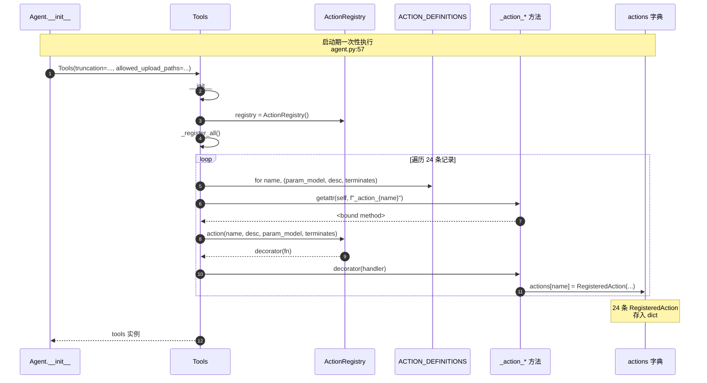
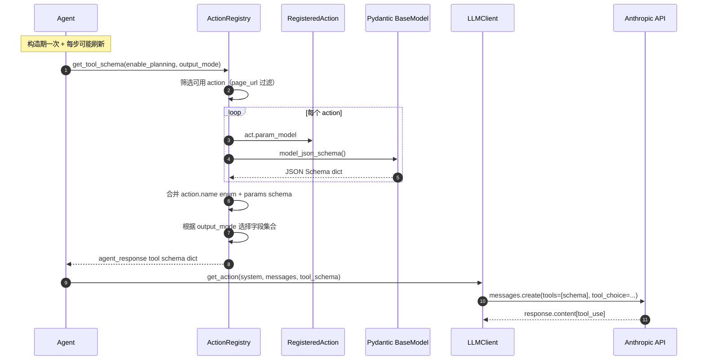
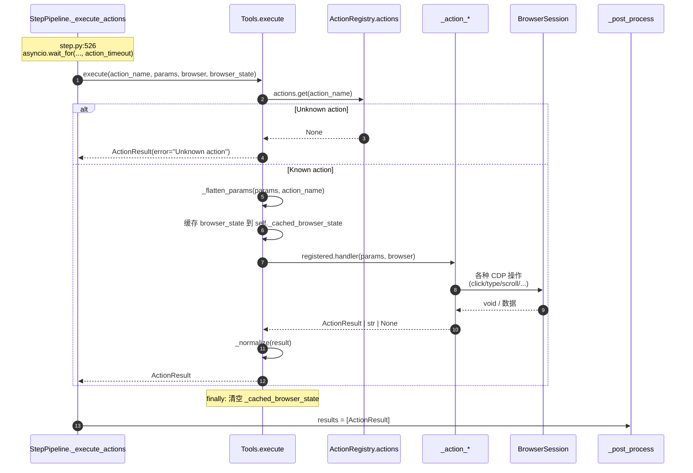

# 02 注册与执行机制

> 本章通过 3 张 Mermaid 序列图 + 核心 API 代码片段，剖析 TreeWalker Tools 子系统的运行时机制：handler 是如何被注册的、Anthropic tool schema 是如何动态生成的、`execute()` 如何把 LLM 决策路由到具体 handler。

---

## 2.1 注册时序图



**关键点**：

- **触发时机**：`Agent.__init__` 第 57 行 `self.tools = tools or Tools(...)`，整个注册流程在 Agent 构造时执行一次
- **数据驱动**：循环源是 `ACTION_DEFINITIONS`（[models.py:138](../../src/tree_walker/tools/models.py)），声明层为准
- **命名约定**：handler 必须严格命名为 `_action_{name}`，否则会被 `getattr` 返回 `None`，触发 debug 日志但不会抛错（[actions.py:174-175](../../src/tree_walker/tools/actions.py)）
- **装饰器立即应用**：`self.registry.action(...)(handler)` 返回的装饰器立刻执行，把 `RegisteredAction` 存入 `actions` 字典

---

## 2.2 Schema 生成时序图



**关键点**：

- **动态生成**：schema 不是硬编码 JSON 文件，每次 `get_tool_schema()` 调用都重新生成。这是为了支持 `page_url` 过滤（不同 URL 下可见 action 集合可能不同）
- **三种 output_mode**（详见 [05_output_mode与JSON样例.md](05_output_mode与JSON样例.md)）：`flash` / `standard` / `thinking`
- **强制单 tool**：所有 action 打包成一个名为 `agent_response` 的 Anthropic tool，LLM 通过 `tool_choice={"type":"tool","name":"agent_response"}` 被强制调用

---

## 2.3 execute 路由时序图



**关键点**：

- **超时保护**：`Step._execute_actions` 用 `asyncio.wait_for(..., timeout=self.action_timeout)` 包裹整个 `execute()` 调用，[step.py:525-528](../../src/tree_walker/agent/step.py)
- **错误兜底**：handler 抛任何异常都被 `try/except` 捕获，转成 `ActionResult(error=str(e))`，[actions.py:144-146](../../src/tree_walker/tools/actions.py)
- **状态缓存**：`_cached_browser_state` 在 execute 开始时写入、`finally` 中清空，handler 内部可通过 `_get_element_by_index()` 直接命中缓存，避免重复 CDP 采集
- **类型归一化**：handler 可以返回 `ActionResult | str | None`，`_normalize()` 统一为 `ActionResult`

---

## 2.4 核心 API 代码片段

### `ActionRegistry.action()`（装饰器工厂）

源码：[registry.py:38-57](../../src/tree_walker/tools/registry.py)

```python
def action(
    self,
    name: str,
    description: str,
    param_model: type[BaseModel],
    terminates: bool = False,
):
    """Decorator to register an action handler."""

    def decorator(fn: Callable[..., Awaitable[ActionResult | str | None]]):
        self.actions[name] = RegisteredAction(
            name=name,
            description=description,
            param_model=param_model,
            handler=fn,
            terminates_sequence=terminates,
        )
        return fn

    return decorator
```

**注意**：装饰器**返回原函数 `fn` 不变**，仅副作用地把 `RegisteredAction` 存入字典。这意味着 `_action_*` 方法在 `Tools` 实例上保持原签名，可被单元测试直接调用。

### `ActionRegistry.get_tool_schema()`（Anthropic schema 工厂）

源码：[registry.py:59-171](../../src/tree_walker/tools/registry.py)

```python
def get_tool_schema(
    self,
    enable_planning: bool = False,
    page_url: str | None = None,
    output_mode: str = "standard",
    include_actions: list[str] | None = None,
) -> dict[str, Any]:
    """Build the Anthropic tool_use schema for the agent_response tool."""
    action_names = sorted(
        name for name in self.actions
        if self._action_available(name, page_url)
        and (include_actions is None or name in include_actions)
    )
    action_descriptions: dict[str, str] = {}
    params_by_action: dict[str, Any] = {}

    for name in action_names:
        act = self.actions[name]
        action_descriptions[name] = act.description
        params_by_action[name] = act.param_model.model_json_schema()

    action_property = {
        "type": "object",
        "required": ["name"],
        "properties": {
            "name": {
                "type": "string",
                "enum": action_names,
                "description": "The action to execute",
            },
            "params": {
                "type": "object",
                "description": (
                    "Action-specific parameters as flat key-value pairs. ..."
                ),
            },
        },
    }

    # Flash mode: minimal schema with only action
    if output_mode == "flash":
        return {
            "name": "agent_response",
            "description": "Respond with the action to take.",
            "input_schema": {
                "type": "object",
                "required": ["action"],
                "properties": {"action": action_property},
            },
        }

    # Standard and thinking modes: full schema
    properties = {
        "evaluation_previous_goal": {"type": "string", "description": "..."},
        "memory": {"type": "string", "description": "..."},
        "next_goal": {"type": "string", "description": "..."},
        "action": action_property,
    }
    required = ["evaluation_previous_goal", "memory", "next_goal", "action"]

    if output_mode == "thinking":
        properties["thinking"] = {"type": "string", "description": "..."}
        required.append("thinking")

    if enable_planning:
        properties["plan_update"] = {
            "type": "array",
            "items": {"type": "string"},
            "description": "Replace the entire plan with these steps. ...",
        }
        properties["current_plan_item"] = {
            "type": "integer",
            "description": "Index of the current plan step to advance to. ...",
        }

    return {
        "name": "agent_response",
        "description": "...",
        "input_schema": {
            "type": "object",
            "required": required,
            "properties": properties,
        },
    }
```

**核心设计**：

- 所有 action 的 `name` 集合作为 `action.name` 字段的 `enum` 值，LLM 必须从中选一个
- `params` 是松散的 `object`（无严格 schema），由 `Tools._flatten_params` 和运行时 Pydantic 校验把关
- 三种 output_mode 的字段差异：
  - `flash`：只有 `action`
  - `standard`：+ `evaluation_previous_goal` + `memory` + `next_goal`
  - `thinking`：+ `thinking`
- `enable_planning=True` 追加 `plan_update` 数组 + `current_plan_item` 索引（**不加入 `required`**）

完整 JSON 输出样例见 [05_output_mode与JSON样例.md](05_output_mode与JSON样例.md)。

### `Tools.execute()`（路由器）

源码：[actions.py:126-148](../../src/tree_walker/tools/actions.py)

```python
async def execute(
    self,
    action_name: str,
    params: dict,
    browser: BrowserSession,
    browser_state: BrowserStateSummary | None = None,
) -> ActionResult:
    """Execute a single action by name with given parameters."""
    if action_name not in self.registry.actions:
        return ActionResult(error=f"Unknown action: {action_name}")

    params = self._flatten_params(params, action_name)

    self._cached_browser_state = browser_state
    try:
        registered = self.registry.actions[action_name]
        result = await registered.handler(params, browser)
        return self._normalize(result)
    except Exception as e:
        logger.exception("Action %s failed", action_name)
        return ActionResult(error=str(e))
    finally:
        self._cached_browser_state = None
```

**注意点**：

- **未知 action 不抛异常**：直接返回 `ActionResult(error="...")`，由上层 `_post_process` 统计失败次数
- **`browser_state` 注入到 `self._cached_browser_state`**：handler 通过 `self._get_element_by_index()` 间接访问缓存
- **`finally` 清缓存**：即使 handler 抛异常，缓存也会被清空，避免下次 execute 误用过期状态

### `Tools._flatten_params()`（嵌套参数展平）

源码：[actions.py:486-497](../../src/tree_walker/tools/actions.py)

```python
@staticmethod
def _flatten_params(params: dict, action_name: str) -> dict:
    """Handle nested params like {"click": {"index": 5}} -> {"index": 5}."""
    if not params:
        return params
    if action_name in params and isinstance(params[action_name], dict):
        return params[action_name]
    # Check for any single nested dict value (common LLM pattern)
    dict_vals = {k: v for k, v in params.items() if isinstance(v, dict)}
    if len(dict_vals) == 1 and len(params) == 1:
        return list(dict_vals.values())[0]
    return params
```

**为什么需要这个**：LLM 有时会把参数嵌套返回，如 `{"click": {"index": 5}}` 而非 `{"index": 5}`。`_flatten_params` 兜底这两种模式，让 handler 始终拿到扁平 dict。

### `Tools._normalize()`（统一返回类型）

源码：[actions.py:499-505](../../src/tree_walker/tools/actions.py)

```python
@staticmethod
def _normalize(result: ActionResult | str | None) -> ActionResult:
    if isinstance(result, ActionResult):
        return result
    if isinstance(result, str):
        return ActionResult(extracted_content=result)
    return ActionResult()
```

**为什么允许 handler 返回 str/None**：

- 部分早期 handler 写法不规范（如 `_action_dropdown_options` 直接 `return str(options)`）
- 用 `_normalize` 把字符串当 `extracted_content` 包装，保留 handler 简洁
- `None` 表示"无特殊结果"，转成默认 `ActionResult()`（渲染为 `"OK"`）

---

## 2.5 页面过滤机制

某些 action 应该只在特定 URL 下可见（如 `upload_file` 只在有文件输入的页面有意义）。TreeWalker 提供 `page_patterns` 字段实现这一点。

### `_action_available()` 判定

源码：[registry.py:30-36](../../src/tree_walker/tools/registry.py)

```python
def _action_available(self, name: str, page_url: str | None) -> bool:
    if page_url is None:
        return True
    action = self.actions[name]
    if action.page_patterns is None:
        return True
    return any(fnmatch.fnmatch(page_url, p) for p in action.page_patterns)
```

**逻辑**：

- `page_url=None` → 不过滤，所有 action 都可用
- `action.page_patterns=None` → 该 action 不过滤，所有 URL 都可见
- 否则用 `fnmatch.fnmatch()` Unix glob 风格匹配，任一 pattern 命中即返回 True

### `apply_page_filters()` 运行时设置

源码：[actions.py:184-192](../../src/tree_walker/tools/actions.py)

```python
def apply_page_filters(self, filters: dict[str, list[str]]) -> None:
    """Apply page-pattern filters to specific actions.

    Each key is an action name; the value is a list of glob patterns.
    Unknown action names are silently ignored.
    """
    for name, patterns in filters.items():
        if name in self.registry.actions:
            self.registry.actions[name].page_patterns = patterns
```

**使用方式**：

- 通过 `AgentSettings.action_page_filters` 配置传入
- 在 `Agent.__init__` 第 58-59 行应用：
  ```python
  if _settings.action_page_filters:
      self.tools.apply_page_filters(_settings.action_page_filters)
  ```
- 形如：`{"upload_file": ["*upload*", "*drive.google.com*"]}` 表示 `upload_file` 仅在 URL 含 upload 或属于 Google Drive 时可见

### 在每步动态刷新 schema

`StepPipeline._update_action_models_for_page`（[step.py:197-207](../../src/tree_walker/agent/step.py)）会在每步开始时基于当前 URL 重新生成 schema：

```python
def _update_action_models_for_page(self, page_url: str) -> None:
    self._tool_schema = self.tools.registry.get_tool_schema(
        page_url=page_url,
        enable_planning=self._enable_planning,
        output_mode=self._output_mode,
    )
    self._system_prompt = build_system_prompt(
        action_descriptions=self.tools.registry.get_action_descriptions_text(page_url=page_url),
        ...
    )
```

这意味着 LLM 看到的可用 action 清单会随页面 URL 变化而变化。

---

## 2.6 Pydantic 参数 Schema 完整列表

下表是 24 个 action 的 `param_model.model_json_schema()` 关键字段摘要。完整 schema 由 Pydantic 自动从 `Field(description=...)` 提取。

### 表格：参数字段一览

| Action | 参数模型 | 必填字段（含默认值即非必填） | 描述 |
|---|---|---|---|
| `navigate` | `NavigateParams` | `url: str` | The URL to navigate to |
| `click` | `ClickParams` | `index: int` | ID of the element to click, shown in brackets in the DOM tree |
| `input_text` | `InputTextParams` | `index: int`, `text: str`, `clear: bool=True` | (index) ID of element; (text) text to type; (clear) clear existing text |
| `scroll` | `ScrollParams` | `amount: int=3`, `direction: Literal["up","down"]="down"` | (amount) scroll increments; (direction) up or down |
| `search` | `SearchParams` | `query: str` | Search query |
| `extract` | `ExtractParams` | `goal: str` | What information to extract |
| `send_keys` | `SendKeysParams` | `keys: str` | e.g. 'Enter', 'Control+a', 'Tab' |
| `switch_tab` | `SwitchTabParams` | `tab_id: str` | Tab ID (last 4 characters) |
| `close_tab` | `CloseTabParams` | `tab_id: str=""` | Empty string closes current tab |
| `wait` | `WaitParams` | `seconds: int=3 (ge=1, le=30)` | Seconds to wait |
| `go_back` | `GoBackParams` | (无参数) | Navigate back |
| `find_elements` | `FindElementsParams` | `selector: str` | CSS selector |
| `find_text` | `FindTextParams` | `text: str` | Text to search for |
| `screenshot` | `ScreenshotParams` | `save_path: str=""` | Optional file path |
| `save_as_pdf` | `SaveAsPdfParams` | `path: str` | File path |
| `dropdown_options` | `DropdownOptionsParams` | `index: int` | ID of select element |
| `select_dropdown` | `SelectDropdownParams` | `index: int`, `value: str` | (index) select ID; (value) option value |
| `upload_file` | `UploadFileParams` | `index: int`, `path: str` | (index) file input ID; (path) local file path |
| `write_file` | `WriteFileParams` | `path: str`, `content: str` | — |
| `read_file` | `ReadFileParams` | `path: str` | — |
| `replace_file` | `ReplaceFileParams` | `path: str`, `old: str`, `new: str` | — |
| `evaluate` | `EvaluateParams` | `code: str` | JavaScript code |
| `search_page` | `SearchPageParams` | `query: str` | Text to search within page |
| `done` | `DoneParams` | `text: str`, `success: bool=True` | (text) final summary; (success) task status |

### 通用约定

所有参数模型共享以下特性（[models.py:6-9](../../src/tree_walker/tools/models.py) 等示例）：

```python
class ClickParams(BaseModel):
    model_config = ConfigDict(extra="forbid")  # 严格模式：拒绝未声明字段
    index: int = Field(description="...")      # 所有字段都强制 description
```

- **`extra="forbid"`**：LLM 返回多余字段会直接抛 `ValidationError`，被 `_validate_action_params` 捕获后触发 retry
- **`Field(description=...)`**：description 同时进入 Pydantic JSON Schema 和系统提示词的 `get_action_descriptions_text()` 输出
- **`Literal[...]`**：如 `direction: Literal["up", "down"]` 强制枚举值

### 完整 JSON Schema 示例（ClickParams）

执行 `ClickParams.model_json_schema()` 得到：

```json
{
  "properties": {
    "index": {
      "description": "ID of the element to click, shown in brackets in the DOM tree",
      "title": "Index",
      "type": "integer"
    }
  },
  "required": ["index"],
  "title": "ClickParams",
  "type": "object",
  "additionalProperties": false
}
```

`additionalProperties: false` 即来自 `extra="forbid"` 配置。

---

## 下一步阅读

→ [03_Agent_Loop交互序列图](03_Agent_Loop交互序列图.md)：看 Tools 如何嵌入 Agent Loop 的 5 阶段管道

← [返回 01 类图](01_类图与模块结构.md) | [返回 README](README.md)
