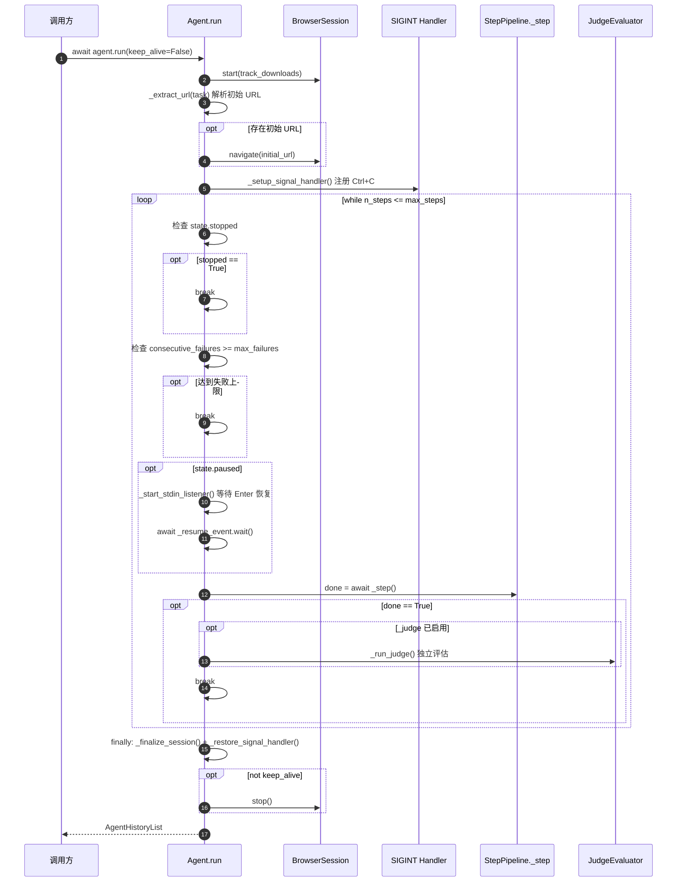

# 03 Agent Loop 交互序列图

> 本章通过多张 Mermaid 序列图，把 Tools 子系统嵌入到 Agent Loop 的完整动态过程中。重点展示「一次 step」从浏览器状态采集、LLM 决策、Tool 执行、状态更新到历史记录的全链路。

---

## 3.1 主循环（Agent.run）序列图



**主循环说明**：

- **三种正常退出路径**：`stopped` 用户中断 / `consecutive_failures` 失败上限 / `_step()` 返回 `done=True` 表示 LLM 主动结束
- **`max_steps` 上限**：靠 `while` 条件控制；最后一步通过 `_force_done_on_last_step` 强制 schema 只含 `done`（见 3.5）
- **`_judge` 可选**：构造时配置 `JudgeSettings.enabled=True` 才会启用，在 `done` 之后做独立评估（agent.py:295-318）
- **`keep_alive`**：默认 `False`，循环结束后关停浏览器；外部 TUI 可能传 `True` 保留浏览器进程用于调试

源码：[agent.py:184-231](../../src/tree_walker/agent/agent.py)

---

## 3.2 完整「一次 step」序列图

下图是 Tools 子系统与 Agent Loop 的核心交互，覆盖 5 阶段管道全部细节：

```mermaid
sequenceDiagram
    autonumber
    participant Step as _step orchestrator
    participant Prep as _prepare_context (Sense)
    participant Browser as BrowserSession
    participant Loop as LoopDetector
    participant LLMCall as _get_next_action (Think)
    participant LLM as LLMClient
    participant Anthropic as Anthropic API
    participant Exec as _execute_actions (Act)
    participant Tools as Tools.execute
    participant Handler as _action_*
    participant Post as _post_process
    participant Fin as _finalize

    Step->>Step: _step_start_time = time.time()
    Step->>Prep: await _prepare_context()

    Note over Prep: 阶段 1: Sense
    Prep->>Browser: get_state(include_screenshot=True)
    Browser-->>Prep: BrowserStateSummary
    Prep->>Loop: record_page(url)
    Prep->>Prep: _update_action_models_for_page(url)
    Note over Prep: 根据 URL 重新生成<br/>_tool_schema + _system_prompt
    Prep->>Prep: build_state_message(previous_result, ...)
    Prep->>Prep: messages.append(user message)
    Prep->>Prep: _inject_budget_warning() (>=75% steps)
    Prep->>Prep: _force_done_on_last_step() (最后一步)
    Prep->>Prep: _force_done_after_failure() (失败上限)
    Prep-->>Step: (browser_state, state_message)

    Step->>Step: state.last_model_output = None
    Step->>Step: state.last_result = None

    Note over Step: 阶段 2: Think
    Step->>LLMCall: await _get_next_action(browser_state, state_message)
    LLMCall->>LLMCall: _trim_messages()
    LLMCall->>LLMCall: asyncio.wait_for(_get_action_with_retry, llm_timeout)
    LLMCall->>LLM: get_action(system, messages, tool_schema)
    LLM->>Anthropic: messages.create(tools=[schema], tool_choice=...)
    Anthropic-->>LLM: response.content[tool_use]
    LLM-->>LLMCall: parsed dict {evaluation, memory, next_goal, action}
    LLMCall->>LLMCall: _validate_action_params (Pydantic)
    opt 参数无效
        LLMCall->>LLM: retry with clarification (最多 2 次)
    end
    LLMCall->>LLMCall: messages.append(assistant message)
    LLMCall-->>Step: model_output dict

    Note over Step: 阶段 3: Act
    Step->>Exec: await _execute_actions(model_output, browser_state)
    Exec->>Exec: 解析 action.name + action.params
    Exec->>Exec: pre_action_url = browser_state.url
    Exec->>Exec: asyncio.wait_for(tools.execute(...), action_timeout)
    Exec->>Tools: execute(action_name, params, browser, browser_state)
    Tools->>Tools: _flatten_params
    Tools->>Handler: registered.handler(params, browser)
    Handler->>Browser: 各种 CDP 操作
    Browser-->>Handler: void / 数据
    Handler-->>Tools: ActionResult | str | None
    Tools->>Tools: _normalize
    Tools-->>Exec: ActionResult

    opt action not in _NO_URL_CHECK_ACTIONS
        Exec->>Browser: get_current_url()
        Note over Exec: 检测页面是否变化
    end
    Exec-->>Step: [ActionResult]

    Note over Step: 阶段 4: Post-process
    Step->>Post: _post_process(results, model_output)
    Post->>Post: state.last_result = results
    Post->>Post: state.last_model_output = model_output
    opt planning enabled
        Post->>Post: plan_manager.update_from_model_output
    end
    Post->>Loop: record_action (skip _LOOP_EXEMPT_ACTIONS)
    opt results[-1].error
        Post->>Post: consecutive_failures++
    else success
        Post->>Post: consecutive_failures = 0
    end
    Post->>Post: 彩色日志输出 (SUCCESS / FAILED / OK)
    Post-->>Step: void

    opt any(r.is_done for r in results)
        Step-->>Step: return True (done)
    end
    opt consecutive_failures >= max_failures
        Step-->>Step: return True (done)
    end

    Note over Step: 阶段 5: Finalize (finally 块)
    Step->>Fin: _finalize(browser_state, model_output, results)
    Fin->>Fin: history.history.append(AgentHistory(...))
    Fin->>Fin: 发射 StepEndEvent (observability)
    Fin->>Fin: state.n_steps += 1

    Step-->>Agent: return is_done
```

**关键交互点**：

| 编号 | 阶段 | 交互 | 源码 |
|---|---|---|---|
| ① | Sense | `Browser.get_state(include_screenshot=True)` 返回完整 DOM + 截图 | [step.py:127](../../src/tree_walker/agent/step.py) |
| ② | Sense | `_update_action_models_for_page` 根据 URL 刷新 schema | [step.py:197-207](../../src/tree_walker/agent/step.py) |
| ③ | Think | `LLMClient.get_action` → Anthropic `messages.create` | [client.py:165-187](../../src/tree_walker/llm/client.py) |
| ④ | Think | Pydantic 校验失败重试（最多 2 次） | [step.py:410-451](../../src/tree_walker/agent/step.py) |
| ⑤ | Act | `tools.execute` 路由到 `_action_*` handler | [step.py:525-528](../../src/tree_walker/agent/step.py) → [actions.py:126-148](../../src/tree_walker/tools/actions.py) |
| ⑥ | Act | `action_timeout` 包裹整个 execute | [step.py:525](../../src/tree_walker/agent/step.py) |
| ⑦ | Post | `_LOOP_EXEMPT_ACTIONS` 跳过 `wait/done/go_back` 的循环检测 | [step.py:585-586, 736](../../src/tree_walker/agent/step.py) |
| ⑧ | Finalize | `state.n_steps += 1` 放在最后，所有消费者看到当前值 | [step.py:651](../../src/tree_walker/agent/step.py) |

---

## 3.3 5 阶段职责详解

### 阶段 1: Sense — `_prepare_context`

源码：[step.py:124-193](../../src/tree_walker/agent/step.py)

```python
async def _prepare_context(self) -> tuple[BrowserStateSummary, str]:
    # 1. Get browser state
    browser_state = await self.browser.get_state(include_screenshot=True)
    # 2. Log step context
    self._log_step_context(browser_state)
    # 2b. Update action models based on current page URL
    self._update_action_models_for_page(browser_state.url)
    # 3. Record page for loop detection
    self.loop_detector.record_page(browser_state.url)
    # 3b. Build plan description and planning nudge (if planning enabled)
    # ... (省略 plan_manager 调用)
    # 4. Build state message (includes loop detection nudge inline)
    nudge = self.loop_detector.get_nudge_message()
    # 4b. Check for new downloads
    # ... (省略 download tracking)
    state_msg = build_state_message(
        browser_state=browser_state,
        task=self._safe_task,
        previous_result=self.state.last_result,
        previous_evaluation=self._last("evaluation_previous_goal"),
        previous_memory=self._last("memory"),
        previous_goal=self._last("next_goal"),
        current_target_id=self.browser.current_target_id,
        nudge_message=nudge,
        plan_description=plan_description,
        planning_nudge=planning_nudge,
        download_notice=download_notice,
    )
    self.messages.append({"role": "user", "content": state_msg})
    # 5. Inject budget warning (>=75% steps used)
    self._inject_budget_warning()
    # 6. Force done on last step
    self._force_done_on_last_step()
    # 7. Force done after consecutive failures
    self._force_done_after_failure()
    return browser_state, state_msg
```

**关键点**：

- **截图始终采集**：`include_screenshot=True`，因为多模态 LLM 会读图
- **action 可见性随 URL 变化**：`_update_action_models_for_page` 每步刷新 schema + system prompt
- **3 种用户提示注入**：循环检测 nudge / 预算警告 / 强制 done（详见 3.5）
- **历史结果回填**：上一步的 `ActionResult` 通过 `previous_result` 参数注入到状态消息，让 LLM 看到反馈

### 阶段 2: Think — `_get_next_action`

源码：[step.py:292-361](../../src/tree_walker/agent/step.py) + [363-451](../../src/tree_walker/agent/step.py)（重试链）

核心调用链：

```python
# step.py:298-318
trimmed = self._trim_messages()
try:
    response = await asyncio.wait_for(
        self._get_action_with_retry(trimmed),
        timeout=self.llm_timeout,
    )
except asyncio.TimeoutError:
    raise TimeoutError(f"LLM call timed out after {self.llm_timeout}s. ...")
```

```python
# step.py:378-382
response = await self.llm.get_action(
    system_prompt=self._system_prompt,
    messages=messages,
    tool_schema=self._tool_schema,
)
```

```python
# step.py:416-477 (参数校验)
param_error = self._validate_action_params(response)
if param_error is None:
    return response
for attempt in range(_PARAM_VALIDATION_MAX_RETRIES):
    retry_messages = list(original_messages) + [{
        "role": "user",
        "content": f"Your action parameters are invalid: {param_error}. ...",
    }]
    response = await self.llm.get_action(...)
    param_error = self._validate_action_params(response)
    if param_error is None:
        return response
```

**重试链**（3 层）：

1. **空 action 重试**：LLM 返回的 `action.name` 为空字符串 → append 澄清 message 重试 1 次
2. **Pydantic 参数校验重试**：参数类型 / 范围不匹配 → 带错误信息重试最多 2 次
3. **Fallback done**：仍失败 → 返回 `_FALLBACK_DONE_OUTPUT`（done with success=False）

源码：[step.py:33-38](../../src/tree_walker/agent/step.py)

```python
_FALLBACK_DONE_OUTPUT: dict[str, Any] = {
    "evaluation_previous_goal": "No action returned",
    "memory": "",
    "next_goal": "Ending task",
    "action": {"name": "done", "params": {"text": "No action returned by LLM", "success": False}},
}
```

### 阶段 3: Act — `_execute_actions`

源码：[step.py:490-556](../../src/tree_walker/agent/step.py)

```python
async def _execute_actions(self, model_output, browser_state):
    if self.state.stopped or self.state.paused:
        return [ActionResult(error="Agent stopped or paused")]

    action = model_output.get("action", {})
    action_name = action.get("name", "done")
    action_params = action.get("params", {})

    # ... (observability ToolCallEvent 发射)

    pre_action_url = browser_state.url

    try:
        result = await asyncio.wait_for(
            self.tools.execute(action_name, action_params, self.browser, browser_state),
            timeout=self.action_timeout,
        )
    except asyncio.TimeoutError:
        logger.warning("Action '%s' timed out after %ds", action_name, self.action_timeout)
        result = ActionResult(error=f"Action timed out after {self.action_timeout}s")
    except Exception as e:
        if _is_connection_error(e):
            raise  # 上抛触发重连
        logger.error("Action '%s' raised %s: %s", action_name, type(e).__name__, e)
        result = ActionResult(error=f"{type(e).__name__}: {e}")

    # ... (observability ToolResultEvent 发射)

    if not result.error and action_name not in _NO_URL_CHECK_ACTIONS:
        try:
            post_url = await self.browser.get_current_url()
            if post_url and post_url != pre_action_url:
                logger.debug("Page changed after '%s': %s -> %s", ...)
        except Exception:
            pass

    return [result]
```

**关键点**：

- **超时双层保护**：外层 `asyncio.wait_for(action_timeout)` 兜底；内层各 handler 通常无超时
- **连接错误上抛**：`_is_connection_error(e)` 返回 True 时**不**包装为 ActionResult，让 `_handle_step_error` 接管重连逻辑（[step.py:670-696](../../src/tree_walker/agent/step.py)）
- **URL diff 跳过列表**：`_NO_URL_CHECK_ACTIONS`（[step.py:740-745](../../src/tree_walker/agent/step.py)）跳过 17 个不会改变 URL 的 action（click/input_text/scroll 等）

### 阶段 4: Post-process — `_post_process`

源码：[step.py:560-610](../../src/tree_walker/agent/step.py)

```python
def _post_process(self, results, model_output):
    self.state.last_result = results
    self.state.last_model_output = model_output

    # Update plan state from model output (if planning enabled)
    if self._enable_planning and self.plan_manager:
        self.plan_manager.update_from_model_output(self.state, model_output)

    # Record action to loop detector with exemption filtering
    action = model_output.get("action", {})
    action_name = action.get("name", "done")
    action_params = action.get("params", {})
    if action_name not in _LOOP_EXEMPT_ACTIONS:
        self.loop_detector.record_action(action_name, action_params)

    # Failure count: single-action error → increment + early return
    if results and len(results) == 1 and results[-1].error:
        self.state.consecutive_failures += 1
        return

    # Success → reset failure counter
    if self.state.consecutive_failures > 0:
        self.state.consecutive_failures = 0

    # Completion result logging
    if results and results[-1].is_done:
        result = results[-1]
        if result.success:
            logger.info("\n\n\033[32m Task SUCCESS\033[0m\n%s\n", result.extracted_content or "")
        else:
            logger.info("\n\n\033[31m Task FAILED\033[0m\n%s\n", result.extracted_content or "")
```

**循环检测豁免**（[step.py:736](../../src/tree_walker/agent/step.py)）：

```python
_LOOP_EXEMPT_ACTIONS = frozenset({"wait", "done", "go_back"})
```

这三个 action 即使连续重复多次也不触发循环警告，因为它们本身就是"原地"或"终止"操作。

### 阶段 5: Finalize — `_finalize`

源码：[step.py:614-666](../../src/tree_walker/agent/step.py)

```python
def _finalize(self, browser_state, model_output, results):
    if model_output is not None:
        state_summary = None
        if browser_state:
            state_summary = {
                "url": browser_state.url,
                "title": browser_state.title,
                "duration": time.time() - self._step_start_time,
            }
        self.history.history.append(AgentHistory(
            step_number=self.state.n_steps,
            model_output=model_output,
            result=results,
            state_summary=state_summary,
        ))

    if self._obs_bus:
        # ... 发射 StepEndEvent

    self._log_step_completion_summary(results)
    self.state.n_steps += 1
```

**关键点**：

- **`_finalize` 在 finally 块中执行**：即使 step 抛异常也会跑，确保历史记录和步数都更新
- **`n_steps += 1` 放在最后**：所有消费者（loop detector、budget warning、force_done 判断）在执行时看到的都是当前 step 值
- **`model_output is None` 表示 step 早退**（如 stopped/paused），此时跳过历史记录但仍递增步数

---

## 3.4 终止条件矩阵

| 终止方式 | 触发条件 | 检测位置 | 处理 |
|---|---|---|---|
| **LLM 主动 done** | LLM 返回 `action.name == "done"` | step.py:101-102 | `_step` 返回 True，`Agent.run` break |
| **达到 max_steps** | `state.n_steps > max_steps`（默认 100） | agent.py:197 while 条件 | 最后一步 `_force_done_on_last_step` 强制 schema 只含 done |
| **达到 max_failures** | `consecutive_failures >= max_failures`（默认 5） | agent.py:202 | 失败上限那一步 `_force_done_after_failure` 强制 schema 只含 done |
| **用户中断** | `state.stopped == True` | agent.py:198 | 第一次 Ctrl+C 暂停（pause），第二次 Ctrl+C 停止（stop） |

### 强制 done 机制

源码：[step.py:246-277](../../src/tree_walker/agent/step.py)

```python
def _force_done_on_last_step(self) -> None:
    """Force LLM to call done on the last step."""
    if self.state.n_steps >= self.max_steps - 1:
        msg = (
            "LAST STEP: You have reached max_steps - this is your final step. "
            'You must call the "done" action now. '
            "Summarize what you have accomplished so far."
        )
        self.messages.append({"role": "user", "content": msg})
        self._tool_schema = self.tools.registry.get_tool_schema(
            include_actions=["done"],  # 关键：schema 只含 done
            output_mode=self._output_mode,
        )

def _force_done_after_failure(self) -> None:
    """Force LLM to call done after consecutive failures reach max."""
    if self.state.consecutive_failures >= self.max_failures:
        msg = (
            f"FAILURE LIMIT: You have failed {self.state.consecutive_failures} consecutive times. "
            'You must call the "done" action now with whatever results you have.'
        )
        self.messages.append({"role": "user", "content": msg})
        self._tool_schema = self.tools.registry.get_tool_schema(
            include_actions=["done"],
            output_mode=self._output_mode,
        )
```

**注意**：`get_tool_schema(include_actions=["done"])` 利用 [02_注册与执行机制.md](02_注册与执行机制.md) 中介绍的 `include_actions` 参数，把 `action.name` 的 enum 限制为只有 `done`。LLM 别无选择。

### Ctrl+C 信号处理

源码：[agent.py:250-258](../../src/tree_walker/agent/agent.py)

```python
def _sigint_handler(self, signum: int, frame) -> None:
    """Signal handler for Ctrl+C: first pause, second stop."""
    self._ctrl_c_count += 1
    if self._ctrl_c_count == 1:
        if self._loop:
            self._loop.call_soon_threadsafe(self.pause)  # 第一次：暂停
    else:
        if self._loop:
            self._loop.call_soon_threadsafe(self.stop)   # 第二次：停止
```

`call_soon_threadsafe` 是关键：信号 handler 在主线程之外触发，必须用线程安全的方式调度回事件循环。

---

## 3.5 特殊控制机制

### Budget Warning（步数预算警告）

源码：[step.py:229-244](../../src/tree_walker/agent/step.py)

```python
def _inject_budget_warning(self) -> None:
    """Inject a budget warning when >= 75% of steps are used."""
    steps_used = self.state.n_steps + 1
    budget_ratio = steps_used / self.max_steps
    if budget_ratio >= 0.75 and self.state.n_steps < self.max_steps:
        steps_remaining = self.max_steps - steps_used
        pct = int(budget_ratio * 100)
        msg = (
            f"BUDGET WARNING: You have used {steps_used}/{self.max_steps} steps "
            f"({pct}%). {steps_remaining} steps remaining. "
            f"If the task cannot be completed in the remaining steps, "
            f"prioritize consolidating your results and call done. "
            f"Partial results are far more valuable than exhausting all steps with nothing saved."
        )
        self.messages.append({"role": "user", "content": msg})
```

**触发条件**：`steps_used / max_steps >= 0.75`，例如 `max_steps=100` 时第 75 步触发。

### Loop Detection Nudge

`ActionLoopDetector` 记录最近 N 个 action（`record_action`），检测重复模式。命中时通过 `get_nudge_message()` 返回警告，被 `build_state_message` 嵌入用户消息。

详见 `src/tree_walker/agent/loop_detector.py`（不在本文讨论范围）。

---

## 3.6 Tool 调用链路追踪

下表追踪一个完整的 Action 调用从 LLM 响应到最终 CDP 命令的全过程：

| 步骤 | 组件 | 方法 | 文件:行号 | 数据 |
|---|---|---|---|---|
| 1 | Anthropic API | HTTP 响应 | — | `{"type":"tool_use","name":"agent_response","input":{...}}` |
| 2 | `LLMClient.get_action` | 遍历 `response.content` | client.py:200-204 | 找到 `tool_use` block，取 `block.input` |
| 3 | `LLMClient.get_action` | 提取 action dict | client.py:241-250 | `{name, params}` + `evaluation_previous_goal` 等元字段 |
| 4 | `StepPipeline._validate_action_params` | Pydantic 校验 | step.py:453-477 | `param_model.model_validate(flat_params)` |
| 5 | `StepPipeline._execute_actions` | 解析 + 超时包裹 | step.py:506-528 | `action_name`, `action_params` |
| 6 | `Tools.execute` | 查表 + 展平 | actions.py:134-139 | `registry.actions[name].handler` |
| 7 | `_action_*` handler | 业务逻辑 | actions.py:196-482 | 调用 `browser.<method>()` |
| 8 | `BrowserSession.<method>` | CDP 调用 | session.py:380-864 | `await self.client.send.<Domain>.<Method>(params)` |
| 9 | `CDPClient` (cdp_use 库) | WebSocket 发送 | （库内部） | CDP JSON-RPC 帧 |
| 10 | Chrome | 执行 | — | DOM 事件 / 页面变化 |
| 11 | `BrowserSession.get_state`（下一步） | 采集结果 | session.py:281 | 新的 `BrowserStateSummary` |
| 12 | `build_state_message` | 拼接 previous_result | system_prompt.py:92-96 | `[Previous Action Results]\n{ActionResult.__str__()}` |

### 关键设计观察

- **ActionResult 通过文本回填**：上一步的结果不通过 `tool_result` 块，而是通过下一轮的 `user` message 中的 `[Previous Action Results]` 文本块。这与 OpenAI Function Calling 的标准做法不同。
- **结果有截断**：`ActionResult.__str__` 把 `extracted_content` 截断到 `display_max_chars=500`，避免上下文爆炸
- **同步等待**：整个 step 是异步串行执行的（无并行 action）；Anthropic API 调用、Tool 执行、状态采集依次进行

---

## 下一步阅读

→ [04_动作清单与CDP映射](04_动作清单与CDP映射.md)：看 24 个具体 action 做了什么、调了哪些 CDP 命令

← [返回 02 注册与执行机制](02_注册与执行机制.md) | [返回 README](README.md)
