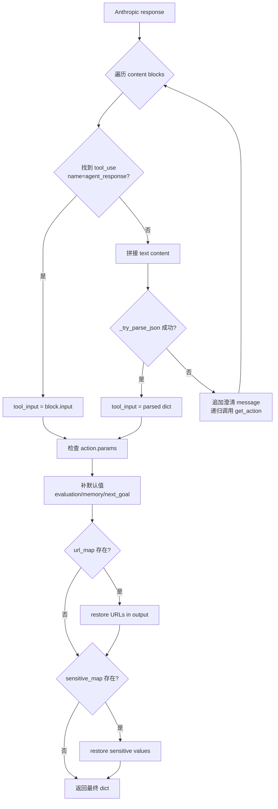
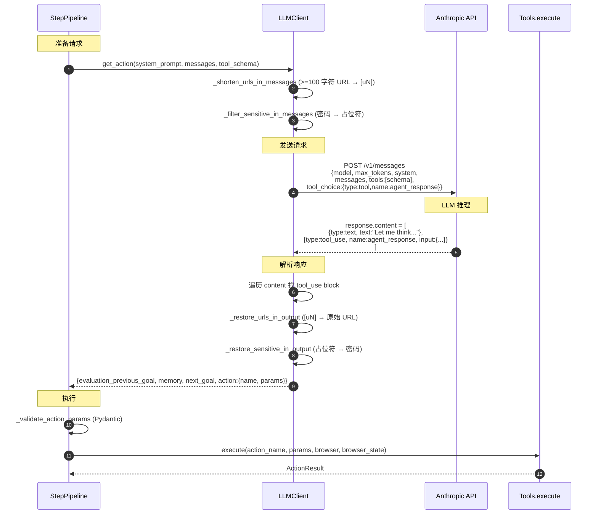

# 05 output_mode 与 JSON 样例

> 本章给出 TreeWalker 与 Anthropic API 交互的完整 JSON 实例，覆盖三种 `output_mode`（flash / standard / thinking）+ `enable_planning` 的 schema 差异，以及真实 LLM 返回的 `tool_use` 响应样例。

---

## 5.1 三种 output_mode 对比

| 维度 | `flash` | `standard`（默认） | `thinking` |
|---|---|---|---|
| **必填字段** | `action` | `evaluation_previous_goal` + `memory` + `next_goal` + `action` | `evaluation_previous_goal` + `memory` + `next_goal` + `action` + `thinking` |
| **强制思考** | 否 | 仅 `evaluation_previous_goal` 简短回顾 | 完整 `thinking` 字段推理 |
| **Token 开销** | 最低 | 中等 | 最高 |
| **适用模型** | 小模型 / 简单任务 | glm-5.1 / Claude Sonnet / 一般 Agent | Claude Opus / o1 / 复杂任务 |
| **可观测性** | 弱（只有 action） | 中（含记忆 + 目标） | 强（完整推理链） |
| **代码位置** | registry.py:100-112 | registry.py:114-129 | registry.py:138-144 |

### 模式选择策略

源码：[agent.py:117](../../src/tree_walker/agent/agent.py)

```python
self._output_mode = getattr(llm, 'output_mode', 'standard')
```

- 默认 `standard`
- 通过 `LLMSettings.output_mode` 配置
- `LLMClient.__init__` 把 settings 的 `output_mode` 暴露为属性供 Agent 读取

### `enable_planning` 字段（叠加而非互斥）

`enable_planning=True` 时，**任何 output_mode 都会追加**两个字段（注意：**不**加入 `required`）：

| 字段 | 类型 | 描述 |
|---|---|---|
| `plan_update` | `array[string]` | Replace the entire plan with these steps. Use when creating a new plan or revising the current plan. |
| `current_plan_item` | `integer` | Index of the current plan step to advance to. Steps between current and this index will be marked as done. |

源码：[registry.py:146-155](../../src/tree_walker/tools/registry.py)

---

## 5.2 三种 Schema 完整 JSON 输出

下面给出 `ActionRegistry.get_tool_schema()` 在不同模式下的实际返回值（基于源码静态分析；实际可执行 `python -c "from tree_walker.tools import ActionRegistry, Tools; import json; print(json.dumps(Tools().registry.get_tool_schema(output_mode='standard'), indent=2, ensure_ascii=False))"` 验证）。

为节省篇幅，action 列表仅展示前 3 个；完整 24 个 action 的 enum 值见 [04_动作清单与CDP映射](04_动作清单与CDP映射.md)。

### 5.2.1 flash 模式

```json
{
  "name": "agent_response",
  "description": "Respond with the action to take.",
  "input_schema": {
    "type": "object",
    "required": ["action"],
    "properties": {
      "action": {
        "type": "object",
        "required": ["name"],
        "properties": {
          "name": {
            "type": "string",
            "enum": ["click", "close_tab", "done", "dropdown_options",
                     "evaluate", "extract", "find_elements", "find_text",
                     "go_back", "input_text", "navigate", "read_file",
                     "replace_file", "save_as_pdf", "screenshot", "scroll",
                     "search", "search_page", "select_dropdown", "send_keys",
                     "switch_tab", "upload_file", "wait", "write_file"],
            "description": "The action to execute"
          },
          "params": {
            "type": "object",
            "description": "Action-specific parameters as flat key-value pairs. For example: click -> {\"index\": 42}, input_text -> {\"index\": 187, \"text\": \"hello\", \"clear\": true}, navigate -> {\"url\": \"https://...\"}. See Available Actions above for each action's expected params."
          }
        }
      }
    }
  }
}
```

### 5.2.2 standard 模式（默认）

```json
{
  "name": "agent_response",
  "description": "Respond with your evaluation, memory, next goal, and the action to take.",
  "input_schema": {
    "type": "object",
    "required": ["evaluation_previous_goal", "memory", "next_goal", "action"],
    "properties": {
      "evaluation_previous_goal": {
        "type": "string",
        "description": "Evaluate whether the previous goal was achieved. On the first step, say 'Starting task.'"
      },
      "memory": {
        "type": "string",
        "description": "Key facts and progress to remember across steps. Keep concise."
      },
      "next_goal": {
        "type": "string",
        "description": "What you plan to do in this step."
      },
      "action": {
        "type": "object",
        "required": ["name"],
        "properties": {
          "name": {
            "type": "string",
            "enum": ["click", "close_tab", "done", "..."],
            "description": "The action to execute"
          },
          "params": {
            "type": "object",
            "description": "Action-specific parameters as flat key-value pairs. ..."
          }
        }
      }
    }
  }
}
```

### 5.2.3 thinking 模式

```json
{
  "name": "agent_response",
  "description": "Respond with your thinking process, evaluation, memory, next goal, and the action to take.",
  "input_schema": {
    "type": "object",
    "required": ["evaluation_previous_goal", "memory", "next_goal", "action", "thinking"],
    "properties": {
      "evaluation_previous_goal": { "type": "string", "description": "..." },
      "memory": { "type": "string", "description": "..." },
      "next_goal": { "type": "string", "description": "..." },
      "thinking": {
        "type": "string",
        "description": "Your step-by-step reasoning process. Think through the current state, evaluate options, and explain your decision."
      },
      "action": { /* 同 standard */ }
    }
  }
}
```

### 5.2.4 standard + enable_planning 模式

```json
{
  "name": "agent_response",
  "description": "Respond with your evaluation, memory, next goal, and the action to take.",
  "input_schema": {
    "type": "object",
    "required": ["evaluation_previous_goal", "memory", "next_goal", "action"],
    "properties": {
      "evaluation_previous_goal": { "type": "string", "description": "..." },
      "memory": { "type": "string", "description": "..." },
      "next_goal": { "type": "string", "description": "..." },
      "action": { /* 同 standard */ },
      "plan_update": {
        "type": "array",
        "items": { "type": "string" },
        "description": "Replace the entire plan with these steps. Use when creating a new plan or revising the current plan."
      },
      "current_plan_item": {
        "type": "integer",
        "description": "Index of the current plan step to advance to. Steps between current and this index will be marked as done."
      }
    }
  }
}
```

**注意**：`plan_update` 和 `current_plan_item` **不在 required 列表**，LLM 可选填。

---

## 5.3 真实 LLM tool_use JSON 样例

以下场景展示 Anthropic API 返回的 `response.content` 数组中的 `tool_use` block（即 `LLMClient.get_action` 解析的目标）。

### 场景 1：标准模式 — 点击动作

```json
{
  "type": "tool_use",
  "id": "toolu_01ABCdefGHI",
  "name": "agent_response",
  "input": {
    "evaluation_previous_goal": "Successfully navigated to the login page. The username field is visible.",
    "memory": "Login URL: https://example.com/login. Need to fill username then password.",
    "next_goal": "Click the username input field to focus it before typing.",
    "action": {
      "name": "click",
      "params": {
        "index": 42
      }
    }
  }
}
```

### 场景 2：thinking 模式 — 带推理链

```json
{
  "type": "tool_use",
  "id": "toolu_02JKLmnoPQR",
  "name": "agent_response",
  "input": {
    "thinking": "The login form has two inputs visible at indices 42 (username) and 43 (password). The submit button is at index 50. My previous goal was to type the username, which succeeded based on the ActionResult showing 'OK'. Now I need to type the password. I should first click into the password field (index 43) before typing, because the type_text action targets document.activeElement.",
    "evaluation_previous_goal": "Username 'alice@example.com' was typed successfully.",
    "memory": "Username filled. Password input is at index 43. Submit button at index 50.",
    "next_goal": "Click the password field to focus it, then type the password.",
    "action": {
      "name": "click",
      "params": {
        "index": 43
      }
    }
  }
}
```

### 场景 3：plan_update 场景（启用 planning）

```json
{
  "type": "tool_use",
  "id": "toolu_03STUvwxYZA",
  "name": "agent_response",
  "input": {
    "evaluation_previous_goal": "Starting task. Initial page is the homepage.",
    "memory": "Task: upload profile picture from C:\\\\Users\\\\me\\\\avatar.png",
    "next_goal": "Navigate to the profile settings page.",
    "action": {
      "name": "navigate",
      "params": {
        "url": "https://example.com/settings/profile"
      }
    },
    "plan_update": [
      "Navigate to profile settings page",
      "Click 'Change Avatar' button",
      "Upload file from local path",
      "Verify upload succeeded",
      "Click 'Save' button"
    ],
    "current_plan_item": 0
  }
}
```

### 场景 4：参数校验失败 — 重试时的澄清 message

当 LLM 返回的 params 违反 Pydantic schema（如类型错误）时，`_validate_params_or_retry` 会追加一条 user message 触发重试：

```json
// StepPipeline 追加的 user message（不是 LLM 输出）
{
  "role": "user",
  "content": "Your action parameters are invalid: index: Input should be a valid integer, unable to parse string as an integer. Please fix the parameters and respond again with a valid action."
}
```

LLM 通常会返回修正后的响应：

```json
{
  "type": "tool_use",
  "id": "toolu_04BCDefGHI",
  "name": "agent_response",
  "input": {
    "evaluation_previous_goal": "Retrying after invalid parameter format.",
    "memory": "Previous attempt used string '42' instead of integer 42 for index.",
    "next_goal": "Click the correct element with integer index.",
    "action": {
      "name": "click",
      "params": {
        "index": 42
      }
    }
  }
}
```

### 场景 5：最后一步 — 强制 done-only schema

`_force_done_on_last_step` 把 schema 的 `include_actions` 限制为 `["done"]`：

```json
// 简化后的 tool schema（最后一步）
{
  "name": "agent_response",
  "description": "Respond with your evaluation, memory, next goal, and the action to take.",
  "input_schema": {
    "type": "object",
    "required": ["evaluation_previous_goal", "memory", "next_goal", "action"],
    "properties": {
      "evaluation_previous_goal": { "type": "string" },
      "memory": { "type": "string" },
      "next_goal": { "type": "string" },
      "action": {
        "type": "object",
        "required": ["name"],
        "properties": {
          "name": {
            "type": "string",
            "enum": ["done"]
          },
          "params": {
            "type": "object"
          }
        }
      }
    }
  }
}
```

LLM 别无选择，只能返回 done：

```json
{
  "type": "tool_use",
  "id": "toolu_05ZZZfinal",
  "name": "agent_response",
  "input": {
    "evaluation_previous_goal": "Attempted to complete the task within budget.",
    "memory": "Reached max_steps. Partial result: found 3 of 5 required items.",
    "next_goal": "End task with partial results.",
    "action": {
      "name": "done",
      "params": {
        "text": "Task partially completed. Found 3 of 5 items: [list]. Failed to find items 4 and 5 due to step budget.",
        "success": false
      }
    }
  }
}
```

### 场景 6：fallback done（LLM 完全无响应）

当 LLM 返回空 action 或解析失败时，[step.py:33-38](../../src/tree_walker/agent/step.py) 中的 `_FALLBACK_DONE_OUTPUT` 被注入：

```json
// 不是 LLM 真实返回，是 StepPipeline 构造的兜底
{
  "evaluation_previous_goal": "No action returned",
  "memory": "",
  "next_goal": "Ending task",
  "action": {
    "name": "done",
    "params": {
      "text": "No action returned by LLM",
      "success": false
    }
  }
}
```

---

## 5.4 Anthropic SDK 调用结构

源码：[llm/client.py:165-187](../../src/tree_walker/llm/client.py)

```python
async def get_action(
    self,
    system_prompt: str,
    messages: list[dict[str, Any]],
    tool_schema: dict[str, Any],
) -> dict[str, Any]:
    # URL shortening
    url_map = self._shorten_urls_in_messages(messages)

    # Sensitive data filtering
    sensitive_map = getattr(self, '_sensitive_map', None)
    self._filter_sensitive_in_messages(messages, sensitive_map)

    try:
        response = await self.client.messages.create(
            model=self.model,
            max_tokens=self.max_tokens,
            system=system_prompt,
            messages=messages,
            tools=[tool_schema],
            tool_choice={"type": "tool", "name": "agent_response"},
        )
    except (RateLimitError, APIError) as e:
        if self._try_switch_to_fallback(e):
            return await self.get_action(system_prompt, messages, tool_schema)
        raise
```

### 关键参数

| 参数 | 值 | 说明 |
|---|---|---|
| `model` | `"glm-5.1"`（默认） | 通过 `LLMSettings.model` 配置 |
| `max_tokens` | `4096`（默认） | 通过 `LLMSettings.max_tokens` 配置 |
| `system` | `system_prompt` | 由 `build_system_prompt(action_descriptions=...)` 生成，含可用 action 清单 |
| `messages` | 历史 + 当前状态消息 | 由 `_trim_messages()` 截断（默认保留 20 条） |
| `tools` | `[tool_schema]` | **单 tool**，schema 来自 `get_tool_schema()` |
| `tool_choice` | `{"type": "tool", "name": "agent_response"}` | **强制调用** agent_response 工具 |

### 没有显式设置的参数

| 参数 | 默认 | 影响 |
|---|---|---|
| `temperature` | 1.0（Anthropic 默认） | 不显式控制；如需降低随机性需手动加 |
| `top_p` | 1.0 | 同上 |
| `stop_sequences` | `[]` | 不使用停止序列 |
| `stream` | False | 非流式调用，等待完整响应 |

### 备用 LLM 切换

源码：[client.py:57-69](../../src/tree_walker/llm/client.py)

```python
def _try_switch_to_fallback(self, error: Exception) -> bool:
    """Switch to fallback LLM on rate limit or API error. One-way switch."""
    if self._using_fallback or not self._fallback_client:
        return False
    self.client = self._fallback_client
    self.model = self._fallback_model
    self.max_tokens = self._fallback_max_tokens
    self._using_fallback = True
    logger.warning(
        "Switched to fallback LLM: %s (due to %s: %s)",
        self.model, type(error).__name__, error,
    )
    return True
```

**单向切换**：一旦切到 fallback，不再切回主模型；这是为了避免限流时反复横跳。

---

## 5.5 响应解析路径

源码：[client.py:193-260](../../src/tree_walker/llm/client.py)

```python
# Debug: log raw response content types
block_types = []
for block in response.content:
    block_types.append(getattr(block, "type", str(type(block))))
logger.debug("LLM response blocks: %s", block_types)

# Extract the tool_use block
tool_input: dict[str, Any] = {}
for block in response.content:
    if getattr(block, "type", None) == "tool_use" and getattr(block, "name", None) == "agent_response":
        tool_input = block.input
        break

# Fallback: try to parse text content as JSON
if not tool_input:
    text_content = ""
    for block in response.content:
        if hasattr(block, "text"):
            text_content += block.text
    if text_content.strip():
        parsed = _try_parse_json(text_content)
        if parsed:
            logger.info("Parsed LLM text response as JSON")
            tool_input = parsed
        else:
            logger.warning("LLM returned text (not tool_use), retrying with explicit prompt")
            retry_messages = list(messages) + [
                {"role": "assistant", "content": text_content},
                {"role": "user", "content": "You must respond using the agent_response tool. Call it now with your evaluation, memory, next goal, and action."},
            ]
            return await self.get_action(system_prompt, retry_messages, tool_schema)
```

### 解析流程



### 文本兜底解析 `_try_parse_json`

源码：[client.py:281-309](../../src/tree_walker/llm/client.py)

```python
def _try_parse_json(text: str) -> dict[str, Any] | None:
    """Try to extract a JSON object from text that might contain markdown fences."""
    # 1. 直接 JSON 解析
    text = text.strip()
    if text.startswith("{"):
        try:
            return json.loads(text)
        except json.JSONDecodeError:
            pass

    # 2. 从 markdown 代码块提取
    match = re.search(r"```(?:json)?\s*(\{.*?\})\s*```", text, re.DOTALL)
    if match:
        try:
            return json.loads(match.group(1))
        except json.JSONDecodeError:
            pass

    # 3. 找第一个 { ... } 块
    start = text.find("{")
    end = text.rfind("}")
    if start != -1 and end > start:
        try:
            return json.loads(text[start:end + 1])
        except json.JSONDecodeError:
            pass

    return None
```

**为什么需要文本兜底**：尽管设置了 `tool_choice` 强制调用 tool，但某些第三方 Anthropic 兼容网关（如智谱 GLM）在特定场景下可能返回文本而非 tool_use block。这段兜底保证健壮性。

---

## 5.6 URL 短化与敏感数据过滤

### URL 短化

源码：[client.py:71-103](../../src/tree_walker/llm/client.py)

```python
def _shorten_urls_in_messages(self, messages: list[dict[str, Any]]) -> dict[str, str]:
    """Replace URLs >=100 chars in messages with short [uN] markers."""
    url_map: dict[str, str] = {}
    url_to_tag: dict[str, str] = {}
    counter = 0
    url_pattern = re.compile(r'https?://\S+')

    for msg in messages:
        content = msg.get("content")
        if not isinstance(content, str):
            continue

        def _replace(match: re.Match) -> str:
            nonlocal counter
            url = match.group(0)
            if len(url) < _URL_MIN_LENGTH:  # 100
                return url
            if url in url_to_tag:
                return url_to_tag[url]
            tag = f"[u{counter}]"
            url_map[tag] = url
            url_to_tag[url] = tag
            counter += 1
            return tag

        new_content = url_pattern.sub(_replace, content)
        if new_content != content:
            msg["content"] = new_content

    return url_map
```

**目的**：DOM 状态消息中常含超长 URL（如带各种 query 参数），短化后大幅节省 token；相同的 URL 共享同一标记。

**还原**：在响应解析阶段调 `_restore_urls_in_output(result, url_map)` 把 `[uN]` 还原回原始 URL。

### 敏感数据过滤

源码：[client.py:124-163](../../src/tree_walker/llm/client.py)

`Agent.__init__` 接受 `sensitive_data: dict[str, str]`，例如：

```python
Agent(
    task="Login as alice with password=secret123",
    sensitive_data={"password": "***PASSWORD***"},
    ...
)
```

- 发送前：把 messages 中所有 `"secret123"` 替换为 `"***PASSWORD***"`
- 接收后：把 LLM 输出中的 `"***PASSWORD***"` 还原为 `"secret123"`

**目的**：避免真实密码进入 LLM 上下文（即使被记录到日志也无害）；同时 LLM 仍能理解语义。

---

## 5.7 一次完整 round-trip 的 JSON 流转



---

## 5.8 调试技巧

### 查看 LLM 实际看到的 tool schema

启用 DEBUG 日志后，[step.py:375-376](../../src/tree_walker/agent/step.py) 会输出：

```python
logger.debug("Available actions for this step: %s", action_enum)
logger.debug("Tool schema: %s", json.dumps(self._tool_schema, ensure_ascii=False, indent=2))
```

### 查看 LLM 返回的原始块类型

[client.py:193-197](../../src/tree_walker/llm/client.py)：

```python
block_types = []
for block in response.content:
    block_types.append(getattr(block, "type", str(type(block))))
logger.debug("LLM response blocks: %s", block_types)
```

输出示例：`LLM response blocks: ['text', 'tool_use']` 表示先有思考文本，后有 tool 调用。

### 查看 ActionResult 在下一轮的回填格式

[agent/views.py:27-37](../../src/tree_walker/agent/views.py) 的 `__str__` 决定回填格式：

- `ActionResult(error="...")` → `"[Previous Action Results]\nERROR: ..."`
- `ActionResult(extracted_content="...")` → `"[Previous Action Results]\nEXTRACTED: ...(截断 500)"`
- `ActionResult(is_done=True, success=True)` → `"[Previous Action Results]\nDONE (success=True)"`
- `ActionResult()` → `"[Previous Action Results]\nOK"`

---

## 下一步阅读

← [返回 04 动作清单与 CDP 映射](04_动作清单与CDP映射.md) | [返回 README](README.md)

---

## 附录：本文涉及的核心源码索引

| 主题 | 文件:行号 |
|---|---|
| `get_tool_schema()` | [registry.py:59-171](../../src/tree_walker/tools/registry.py) |
| output_mode 分支 | [registry.py:100-159](../../src/tree_walker/tools/registry.py) |
| enable_planning 分支 | [registry.py:146-155](../../src/tree_walker/tools/registry.py) |
| `get_action()` 主调用 | [client.py:165-260](../../src/tree_walker/llm/client.py) |
| `messages.create` 调用 | [client.py:180-187](../../src/tree_walker/llm/client.py) |
| tool_use 解析 | [client.py:200-204](../../src/tree_walker/llm/client.py) |
| 文本兜底解析 | [client.py:281-309](../../src/tree_walker/llm/client.py) |
| URL 短化 | [client.py:71-103](../../src/tree_walker/llm/client.py) |
| 敏感数据过滤 | [client.py:124-163](../../src/tree_walker/llm/client.py) |
| Fallback LLM 切换 | [client.py:57-69](../../src/tree_walker/llm/client.py) |
| `_FALLBACK_DONE_OUTPUT` | [step.py:33-38](../../src/tree_walker/agent/step.py) |
| `_force_done_on_last_step` | [step.py:246-259](../../src/tree_walker/agent/step.py) |
| `_validate_action_params` | [step.py:453-477](../../src/tree_walker/agent/step.py) |
| `ActionResult.__str__` | [agent/views.py:27-37](../../src/tree_walker/agent/views.py) |
