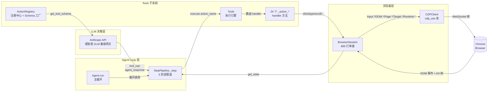

# TreeWalker Tools 技术细节

> 本目录系统化剖析 TreeWalker 项目中 **Tools 子系统** 的工作机制，覆盖类图、序列图、Agent Loop 交互、24 个注册动作的逐一详解、对应的 CDP（Chrome DevTools Protocol）调用映射，以及 LLM `tool_use` 协议在三种 output_mode 下的真实 JSON 样例。

---

## 文档目的与读者

| 项目 | 说明 |
|---|---|
| **目标读者** | TreeWalker 框架的二次开发者、想为项目新增 Action 的贡献者、希望理解 LLM Agent 与浏览器底层如何对话的工程师 |
| **预期背景** | 熟悉 Python 异步编程、了解 Pydantic 数据建模、对 Chrome DevTools Protocol 有概念性认识 |
| **阅读路径** | 第一次阅读建议按编号 01 → 05 顺序；想直接定位某个动作可跳到 [04_动作清单与CDP映射](04_动作清单与CDP映射.md) |
| **配套阅读** | 项目根目录的 `CLAUDE.md`（项目规范）以及同级 `docs/agent-core/` 下已有的 Agent Loop 细节文档 |

---

## 整体架构概览

下图展示了从 LLM 决策到浏览器 CDP 调用的完整数据流：

**数据流文字版（一轮 step）**：

1. `Agent.run()` 循环调用 `StepPipeline._step()`
2. `_prepare_context()` 调 `BrowserSession.get_state()` 拿到 DOM 树 + 截图 + URL/title/tabs
3. `_get_next_action()` 把工具 schema（`agent_response`）和上下文消息一起发给 LLM
4. LLM 返回 `tool_use` block，含 `action: {name, params}`
5. `_execute_actions()` 调 `Tools.execute(name, params, ...)` 路由到具体 `_action_*` handler
6. handler 调 `BrowserSession.click_element()` / `type_text()` / `scroll()` 等，最终走 CDP WebSocket
7. CDP 命令发到 Chrome，DOM 状态变化，进入下一轮

---

## 子文档导航

| 文档 | 主题 | 何时阅读 |
|---|---|---|
| [01_类图与模块结构](01_类图与模块结构.md) | Mermaid 类图、`tools/` 目录文件清单、关键类职责、「无 Tool 基类」设计哲学 | 想理解整体类关系 / 拓展新的 Action 类型时 |
| [02_注册与执行机制](02_注册与执行机制.md) | 注册时序图、Schema 生成时序图、execute 路由时序图、Pydantic Schema 完整列表 | 想了解 Action 如何被发现、注册、调度 |
| [03_Agent_Loop交互序列图](03_Agent_Loop交互序列图.md) | 主循环序列图、完整一次 step 序列图、5 阶段职责、4 种终止条件、force_done/budget warning | 想理解 Tools 与 Agent Loop 如何耦合 |
| [04_动作清单与CDP映射](04_动作清单与CDP映射.md) | 24 个 action 逐一详解 + 对应 CDP 调用矩阵（**核心文档**，篇幅最长） | 想知道某个具体 action 做了什么 / 调了哪些 CDP 命令 |
| [05_output_mode与JSON样例](05_output_mode与JSON样例.md) | flash/standard/thinking 三种 schema 对比、enable_planning 字段、真实 tool_use JSON 样例 | 调试 LLM 返回的 action / 排查 schema 校验失败 |

---

## 术语速查表

| 术语 | 含义 | 源码位置 |
|---|---|---|
| **action** | LLM 可以调用的最小操作单元，如 `click` / `input_text` / `done`。每个 action 对应一个唯一的 name | `tools/models.py:138-199` `ACTION_DEFINITIONS` |
| **handler** | action 的实际执行函数，约定命名为 `_action_{name}`，绑定到 `Tools` 实例 | `tools/actions.py:196-482` |
| **registry** | 注册中心 `ActionRegistry`，存储 `RegisteredAction` 字典 + 生成 schema | `tools/registry.py:26-188` |
| **RegisteredAction** | dataclass，封装一个 action 的全部元数据（name/description/param_model/handler/...） | `tools/registry.py:16-23` |
| **agent_response tool** | 暴露给 LLM 的**唯一** Anthropic tool；所有 action 作为该 tool 的 `action.name` enum 值 | `tools/registry.py:59-171` `get_tool_schema()` |
| **step** | Agent Loop 的一次完整迭代，含 5 阶段（Sense/Think/Act/PostProcess/Finalize） | `agent/step.py:72-111` |
| **output_mode** | 控制 `agent_response` schema 的字段丰富度：`flash` / `standard` / `thinking` | `tools/registry.py:100-159` |
| **terminates_sequence** | 标记 action 是否会终止当前序列（如 `navigate` / `go_back` 切换页面） | `tools/models.py:138` 第 3 列 |
| **page_patterns** | URL glob 过滤器，限制 action 仅在某些 URL 下可见 | `tools/registry.py:23`、`registry.py:30-36` |
| **ActionResult** | 所有 handler 的统一返回类型，含 `is_done/success/error/extracted_content` | `agent/views.py:8-37` |
| **backend_node_id** | CDP 内部稳定的 DOM 节点 ID，跨刷新仍有效；与 index 不同，index 只是 DOM 树序列中的下标 | `browser/views.py EnhancedDOMTreeNode` |

---

## 关键源码文件索引

| 路径 | 行数 | 一句话职责 |
|---|---|---|
| `src/tree_walker/tools/__init__.py` | 11 | 包入口，导出 `ActionRegistry`、`RegisteredAction`、`Tools` |
| `src/tree_walker/tools/models.py` | 199 | 24 个 Pydantic 参数模型 + `ACTION_DEFINITIONS` 声明表 |
| `src/tree_walker/tools/registry.py` | 189 | `ActionRegistry`：注册中心 + Anthropic schema 工厂 |
| `src/tree_walker/tools/actions.py` | 506 | `Tools` 类：执行引擎 + 24 个 `_action_*` handler |
| `src/tree_walker/agent/agent.py` | 346 | `Agent(StepPipeline)`：主循环 + 信号处理 + Judge |
| `src/tree_walker/agent/step.py` | 758 | `StepPipeline` mixin：5 阶段 step 管道 |
| `src/tree_walker/agent/views.py` | 102 | `ActionResult` / `AgentState` / `AgentHistory` 等数据类 |
| `src/tree_walker/llm/client.py` | 310 | `LLMClient`：Anthropic SDK 封装 + tool_use 解析 |
| `src/tree_walker/browser/session.py` | 865 | `BrowserSession`：CDP 客户端 + 所有页面级操作 |
| `src/tree_walker/browser/dom.py` | 1003 | 三源并行 CDP 采集，构建 `EnhancedDOMTree` |
| `src/tree_walker/browser/cdp_timeout.py` | 196 | `run_cdp_batch`：两阶段超时 + 重试 |
| `src/tree_walker/browser/circuit_breaker.py` | 81 | DOM 管线熔断器（closed/open/half_open） |
| `src/tree_walker/browser/highlight.py` | 167 | `HighlightManager`：CDP Overlay 视觉反馈 |

---

## 图表渲染说明

本目录所有图表使用 [Mermaid](https://mermaid.js.org/) 语法。在以下环境可直接渲染：

- **VS Code**：安装 `Markdown Preview Mermaid Support` 扩展
- **GitHub**：原生支持
- **JetBrains IDE**：默认开启
- **命令行预览**：`npx -y @mermaid-js/mermaid-cli -i input.mmd -o output.svg`

---

## 下一步阅读

→ 开始阅读 [01_类图与模块结构](01_类图与模块结构.md)
