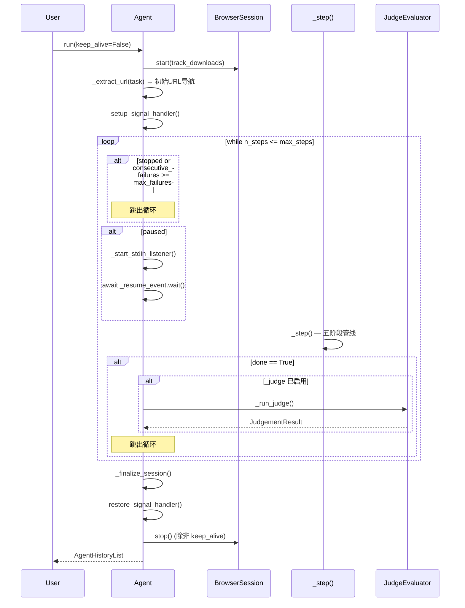
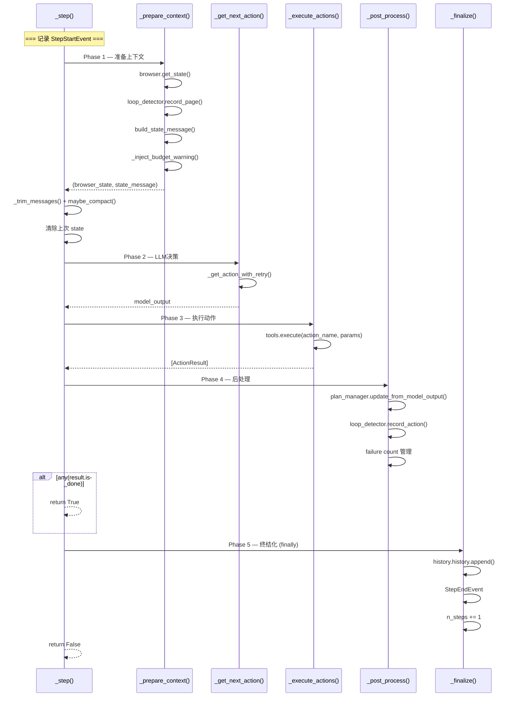
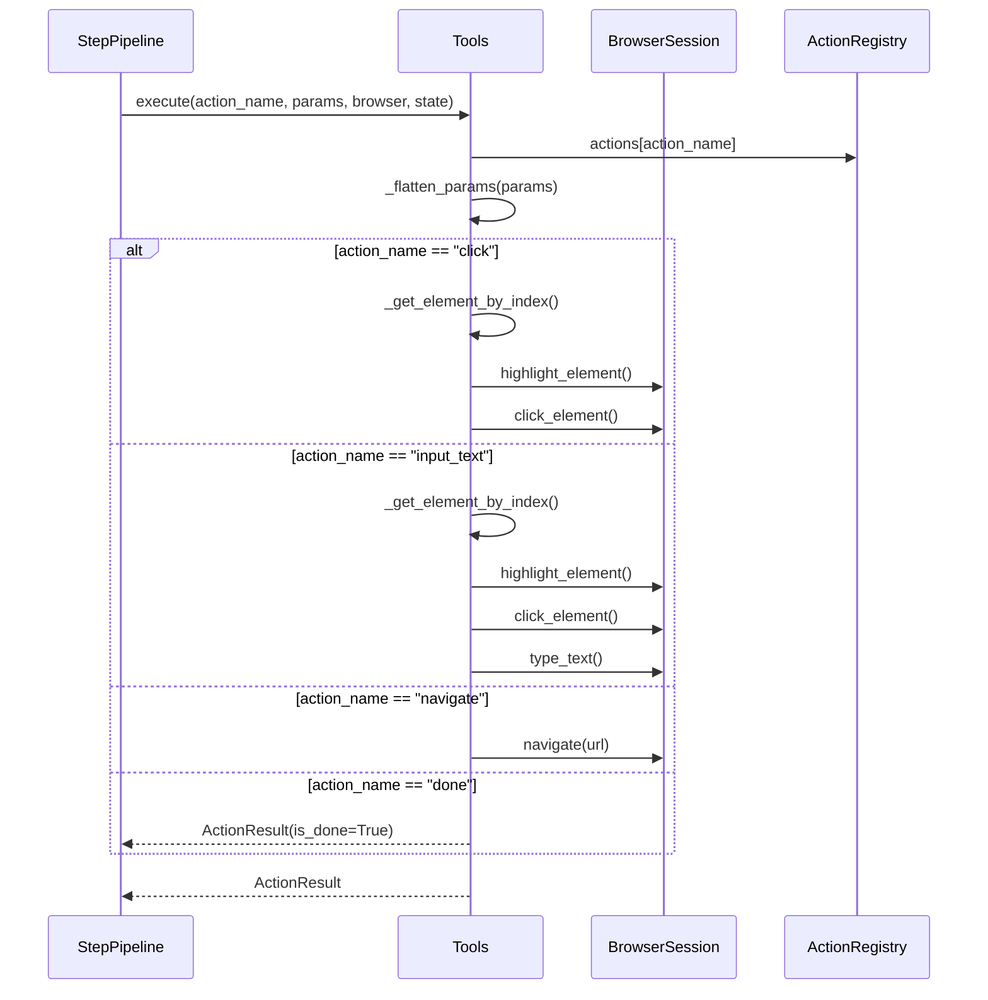
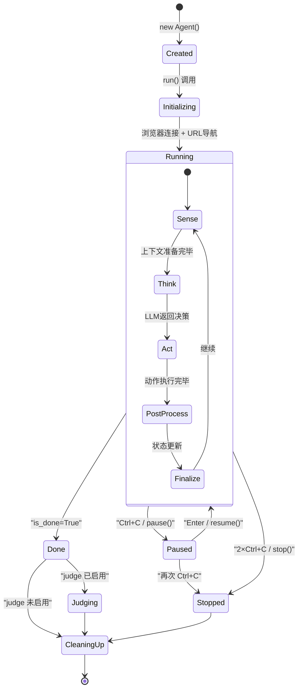
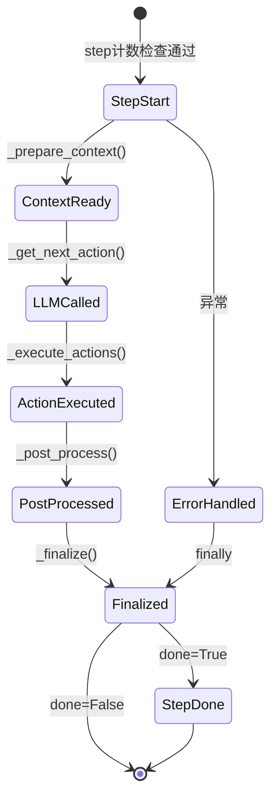

# Agent 运行逻辑分析

> 源码入口: `src/tree_walker/agent/agent.py` — `Agent` 类
> 单步管线: `src/tree_walker/agent/step.py` — `StepPipeline` 混入类

## 1. 架构总览

TreeWalker 是一个 **Sense-Think-Act** 架构的浏览器自动化 Agent。它通过 CDP（Chrome DevTools Protocol）连接浏览器，获取页面 DOM 状态，将页面信息发送给 LLM（Anthropic API）进行决策，然后执行 LLM 选定的浏览器操作。

核心设计原则：

- **五阶段单步管线** — 每个 step 分为 Sense → Think → Act → PostProcess → Finalize 五个阶段，职责清晰
- **Mixin 分层** — `Agent` 继承 `StepPipeline`，后者通过混入模式提供五阶段管线，`Agent` 负责生命周期管理和公共 API
- **工具注册模式** — 所有浏览器操作通过 `ActionRegistry` + `Tools` 统一注册和执行，LLM 通过单一 `agent_response` tool 调用
- **容错优先** — 三层错误处理（重试/降级/兜底），LLM 参数校验重试、连接断开重连、熔断器保护 DOM 采集
- **可观测性管道** — 通过 `EventBus` 发布事件，支持 JSONL 录制、指标聚合、异常检测

---

## 2. 类图

```mermaid
classDiagram
    direction TB

    class StepPipeline {
        <<mixin>>
        +str task
        +LLMClient llm
        +BrowserSession browser
        +Tools tools
        +AgentState state
        +list~dict~ messages
        +str _system_prompt
        +dict _tool_schema
        +ActionLoopDetector loop_detector
        +PlanManager plan_manager
        +EventBus _obs_bus

        +_step() bool
        +_prepare_context() tuple~BrowserStateSummary, str~
        +_get_next_action(browser_state, state_message) dict
        +_execute_actions(model_output, browser_state) list~ActionResult~
        +_post_process(results, model_output) None
        +_finalize(browser_state, model_output, results) None
        +_handle_step_error(error) None
        -_get_action_with_retry(messages) dict
        -_validate_params_or_retry(response, messages) dict
        -_trim_messages() list~dict~
        -_inject_budget_warning() None
        -_force_done_on_last_step() None
        -_force_done_after_failure() None
    }

    class Agent {
        +str task
        +AgentHistoryList history
        -asyncio.Event _resume_event
        -int _ctrl_c_count
        -AbstractEventLoop _loop
        -JudgeEvaluator _judge
        -MessageCompactor _compactor

        +run(keep_alive) AgentHistoryList
        +stop() None
        +pause() None
        +resume() None
        -_run_judge() None
        -_finalize_session() None
        -_sigint_handler(signum, frame) None
        -_setup_signal_handler() None
        -_start_stdin_listener() None
    }

    class AgentState {
        +int n_steps
        +int consecutive_failures
        +list~ActionResult~ last_result
        +dict last_model_output
        +bool stopped
        +bool paused
        +list~DownloadInfo~ downloaded_files
        +list~PlanItem~ plan
        +int current_plan_item_index
        +int plan_generation_step
    }

    class ActionResult {
        +ClassVar~int~ display_max_chars
        +bool is_done
        +bool~str~ success
        +str error
        +str extracted_content
        +Any judgement
    }

    class AgentHistoryList {
        +list~AgentHistory~ history
        +final_result() str
        +is_done() bool
        +is_successful() bool
    }

    class LLMClient {
        +Anthropic client
        +str model
        +int max_tokens
        +str output_mode
        -dict _sensitive_map
        -Anthropic _fallback_client

        +get_action(system_prompt, messages, tool_schema) dict
        +extract(prompt, content) str
        -_try_switch_to_fallback(error) bool
        -_shorten_urls_in_messages(messages) dict
        -_restore_urls_in_output(output, url_map) dict
    }

    class BrowserSession {
        +CDPClient client
        +str current_target_id
        +str current_session_id
        -DOMSelectorMap _cached_selector_map
        -CircuitBreaker _dom_circuit_breaker
        -HighlightManager _highlight

        +start(track_downloads) None
        +stop() None
        +reconnect() bool
        +get_state(include_screenshot) BrowserStateSummary
        +navigate(url) None
        +click_element(backend_node_id) None
        +type_text(text, clear) None
        +send_keys(keys) None
        +scroll(direction, amount) None
        +execute_js(code) Any
        +set_file_input(backend_node_id, file_path) None
    }

    class Tools {
        +ActionRegistry registry
        -BrowserStateSummary _cached_browser_state

        +execute(action_name, params, browser, browser_state) ActionResult
        +apply_page_filters(filters) None
        -_get_element_by_index(index, browser) tuple
        -_action_navigate(params, browser) ActionResult
        -_action_click(params, browser) ActionResult
        -_action_input_text(params, browser) ActionResult
        -_action_done(params, browser) ActionResult
        ... 22 个 _action_* 方法
    }

    class ActionRegistry {
        +dict~RegisteredAction~ actions
        +action(name, desc, param_model, terminates) decorator
        +get_tool_schema(enable_planning, page_url, output_mode) dict
        +get_action_descriptions_text(page_url) str
    }

    class ActionLoopDetector {
        +deque~str~ recent_actions
        +deque~str~ recent_urls
        +record_action(name, params) None
        +record_page(url) None
        +get_nudge_message() str
    }

    class PlanManager {
        +render_plan_description(plan) str
        +update_from_model_output(state, model_output) None
        +build_replan_nudge(failures, threshold, plan) str
        +build_exploration_nudge(n_steps, threshold, plan) str
    }

    class JudgeEvaluator {
        -LLMClient _llm
        +judge(task, history, final_result, max_history_steps) JudgementResult
    }

    class MessageCompactor {
        -LLMClient _llm
        -str _compacted_memory
        +maybe_compact(messages, step_number) None
    }

    StepPipeline <|-- Agent : inherits
    Agent --> AgentState : state
    Agent --> AgentHistoryList : history
    Agent --> LLMClient : llm
    Agent --> BrowserSession : browser
    Agent --> Tools : tools
    Agent --> ActionLoopDetector : loop_detector
    Agent --> PlanManager : plan_manager
    Agent --> JudgeEvaluator : _judge
    Agent --> MessageCompactor : _compactor
    Tools --> ActionRegistry : registry
    AgentState --> ActionResult : last_result
    AgentHistoryList --> AgentHistory : history
```



---

## 3. 核心运行流程 — 时序图

### 3.1 `Agent.run()` 主循环时序图



### 3.2 单步执行 (`_step()`) 五阶段管线



### 3.3 动作执行流程



---

## 4. 状态图

### 4.1 Agent 生命周期状态图



### 4.2 单步内状态转换图



---

## 5. 关键子系统详解

### 5.1 LLM 交互层

LLM 交互由 `LLMClient` 封装（`src/tree_walker/llm/client.py`），使用 Anthropic SDK 的 `tool_use` 模式：

- **统一工具接口** — 所有动作通过单一 `agent_response` tool 返回，包含 `evaluation_previous_goal`、`memory`、`next_goal`、`action` 四个字段
- **三种输出模式** — `standard`（标准四字段）、`flash`（仅 action）、`thinking`（额外 thinking 字段）
- **URL 压缩** — 超过 100 字符的 URL 自动替换为 `[uN]` 标记，相同 URL 共享标记
- **敏感数据过滤** — 任务中的敏感数据在发送前替换为占位符，LLM 输出后恢复
- **Fallback LLM** — 当主 LLM 触发 `RateLimitError` 或 `APIError` 时，自动切换到备用 LLM（单向切换）
- **响应解析降级** — 优先提取 `tool_use` 块 → 尝试 JSON 解析文本 → 重试一次 → fallback done

调用链：
```
StepPipeline._get_next_action()
  → _get_action_with_retry()
    → LLMClient.get_action()
      → Anthropic.messages.create(tools=[agent_response], tool_choice=tool)
      → 解析 tool_use block / 文本 JSON
      → URL/敏感数据恢复
    → _validate_params_or_retry()  [Pydantic 校验，最多重试 2 次]
  → 记录 assistant 消息 + 结构化日志
```

### 5.2 动作执行层

动作执行由 `Tools` 类（`src/tree_walker/tools/actions.py`）管理，`ActionRegistry` 负责注册和 schema 生成：

- **22 个内置动作** — navigate、click、input_text、scroll、search、extract、send_keys、switch_tab、close_tab、wait、go_back、find_elements、find_text、screenshot、save_as_pdf、dropdown_options、select_dropdown、upload_file、write_file、read_file、replace_file、evaluate、search_page、done
- **Pydantic 参数模型** — 每个动作有独立的参数校验模型（`src/tree_walker/tools/models.py`），使用 `extra="forbid"` 严格校验
- **元素查找** — `_get_element_by_index()` 优先从缓存 DOM 状态查找，回退到实时获取
- **动作超时** — 每个动作通过 `asyncio.wait_for` 设置独立的 `action_timeout`（默认 30s）
- **页面变化检测** — 动作执行前后比较 URL，检测页面导航（部分动作豁免）

### 5.3 消息管理

消息历史由 `Agent` 的 `self.messages` 列表管理：

- **消息结构** — `system` (系统提示) + `user`/`assistant` 交替的消息列表
- **消息修剪** — `_trim_messages()` 保留最近 N 条消息（默认 20）
- **消息压缩** — `MessageCompactor` 通过 LLM 将旧消息压缩为摘要（双门控：步数间隔 + 字符数阈值）
- **系统提示构建** — `build_system_prompt()` 将动作描述和任务嵌入模板，`build_state_message()` 构建包含 DOM、URL、Tab、前序结果的 user 消息

### 5.4 循环检测

`ActionLoopDetector`（`src/tree_walker/agent/loop_detector.py`）实现软循环检测：

- **窗口追踪** — 使用 `deque(maxlen=15)` 跟踪最近动作和页面 URL
- **哈希去重** — 动作通过 `name:sorted_params` 哈希，过滤 `text` 和 `clear` 参数
- **分级 nudge** — 重复 5 次 → WARNING，8 次 → 强 WARNING，12+ 次 → CRITICAL
- **豁免动作** — `wait`、`done`、`go_back` 不参与循环检测
- **注入方式** — nudge 消息通过 `build_state_message()` 的 `[System Notice]` 段注入

### 5.5 计划系统

`PlanManager`（`src/tree_walker/agent/plan_manager.py`）提供可选的计划管理：

- **计划创建** — LLM 通过 `plan_update` 字段提交步骤列表
- **步骤推进** — LLM 通过 `current_plan_item` 字段推进当前步骤索引
- **重新规划** — 连续失败超过阈值时注入 replan nudge
- **探索引导** — 无计划探索超过阈值步数时注入 exploration nudge
- **状态渲染** — 计划用 `[x]/[>]/[ ]/[-]` 标记已完成/当前/待办/跳过

---

## 6. 错误处理策略

| 异常类型 | 处理方式 | 失败计数 | 终止行为 |
|---------|---------|---------|---------|
| `InterruptedError` | 日志警告，不计数 | 不增加 | 继续运行 |
| 连接错误 (WebSocket 断开) | 重连循环（最长 reconnect_timeout 秒） | 不增加 | 重连失败则 `stopped=True` |
| `asyncio.TimeoutError` (LLM) | 抛出 `TimeoutError`，由 `_handle_step_error` 处理 | +1 | 达到 max_failures 终止 |
| `asyncio.TimeoutError` (Action) | 返回 `ActionResult(error=...)` | 由 post_process 决定 | 不直接终止 |
| 动作执行异常 (非连接) | 捕获为 `ActionResult(error=...)` | +1 | 达到 max_failures 终止 |
| `ValidationError` (参数) | 重试 LLM 调用（最多 2 次） | 不增加 | 重试后仍无效则使用原始输出 |
| 空动作响应 | 追加澄清消息，重试一次 | 不增加 | 仍为空则 fallback done |

**终止条件汇总：**

1. `state.n_steps > max_steps` — 步数超限
2. `state.consecutive_failures >= max_failures` — 连续失败超限
3. `state.stopped == True` — 用户手动停止（2×Ctrl+C）
4. `any(r.is_done for r in results)` — LLM 调用 done 动作
5. `_force_done_on_last_step()` — 最后一步强制 done
6. `_force_done_after_failure()` — 失败次数达到上限时强制 done

---

## 7. 初始化流程

```
Agent.__init__(task, llm, browser, tools, settings)
  ├── 基础配置
  │   ├── task, llm, browser 赋值
  │   ├── Tools 初始化（或使用传入实例）
  │   ├── ActionResult.display_max_chars 设置
  │   ├── max_steps, max_failures, timeouts 读取
  │   └── 应用 page_filters 到 actions
  ├── 状态初始化
  │   ├── AgentState() → n_steps=0, consecutive_failures=0
  │   ├── AgentHistoryList() → 空历史
  │   ├── ActionLoopDetector() → 空窗口
  │   └── messages = [] → 空消息列表
  ├── 消息压缩
  │   └── MessageCompactor (如果 enabled)
  ├── 敏感数据处理
  │   ├── 构建 _sensitive_map (value → placeholder)
  │   └── 替换 task 中的敏感值 → _safe_task
  ├── 暂停/恢复控制
  │   ├── _resume_event = asyncio.Event(set)
  │   ├── _ctrl_c_count = 0
  │   └── _stdin_thread = None
  ├── 计划系统
  │   └── PlanManager() (如果 enable_planning)
  ├── Judge 评估器
  │   └── JudgeEvaluator(llm) (如果 judge.enabled)
  ├── 可观测性
  │   ├── EventBus()
  │   ├── MetricsAggregator()
  │   ├── JsonlRecorder()
  │   ├── AnomalyDetector()
  │   └── 订阅事件主题
  └── 提示构建
      ├── build_system_prompt() → _system_prompt
      └── get_tool_schema() → _tool_schema
```

---

## 8. 控制流 — 暂停/恢复/停止

```
用户按下 Ctrl+C
  │
  ▼
_sigint_handler(signum, frame)
  │
  ├─ _ctrl_c_count == 1?
  │   └─ Yes → loop.call_soon_threadsafe(pause())
  │            → state.paused = True
  │            → _resume_event.clear()
  │            → _start_stdin_listener()
  │              │
  │              ▼
  │            stdin thread 等待 Enter
  │              │
  │              ▼
  │            loop.call_soon_threadsafe(resume())
  │              → state.paused = False
  │              → _resume_event.set()
  │
  └─ _ctrl_c_count >= 2?
      └─ Yes → loop.call_soon_threadsafe(stop())
               → state.stopped = True
               → _resume_event.set()  [唤醒等待中的 run()]
```

**暂停/停止检查点：**

| 检查位置 | 文件:行号 | 行为 |
|---------|----------|------|
| run() 主循环顶部 | agent.py:198 | 检查 `state.stopped` |
| run() 主循环 | agent.py:210-213 | `paused` 时等待 `_resume_event` |
| _step() 开头 | step.py:88-89 | 准备上下文后检查 `stopped/paused` |
| _execute_actions() 开头 | step.py:503 | 检查 `stopped/paused` |

---

## 9. 关键数据流

```
用户任务 (str)
     │
     ▼
┌───────────┐    ┌─────────────┐    ┌─────────────────┐
│ Browser   │───▶│ DOM State   │───▶│ State Message   │
│ Session   │    │ + Screenshot│    │ (user message)  │
│           │    │ + URL/Title │    │ + DOM Tree Text │
└───────────┘    └─────────────┘    └────────┬────────┘
                                              │
                                              ▼
                                     ┌────────────────┐
                                     │ Messages List  │
                                     │ [system, user, │
                                     │  assistant...] │
                                     └───────┬────────┘
                                              │
                                              ▼
                                     ┌────────────────┐
                                     │   LLM Client   │
                                     │ Anthropic API  │
                                     │ tool_use mode  │
                                     └───────┬────────┘
                                             │
                                             ▼
                                     ┌────────────────┐
                                     │ model_output   │
                                     │ {evaluation,   │
                                     │  memory, goal, │
                                     │  action}       │
                                     └───────┬────────┘
                                             │
                                             ▼
┌───────────┐    ┌─────────────┐    ┌────────────────┐
│ Browser   │◀───│ Tools       │◀───│ Action         │
│ Session   │    │ execute()   │    │ {name, params} │
│ (CDP)     │    │             │    │                │
└─────┬─────┘    └──────┬──────┘    └────────────────┘
      │                 │
      │                 ▼
      │          ┌────────────────┐
      │          │ ActionResult   │
      │          │ {is_done,      │
      │          │  success,      │
      │          │  error,        │
      │          │  extracted}    │
      │          └───────┬────────┘
      │                  │
      ▼                  ▼
┌───────────┐    ┌─────────────────┐
│ Agent     │    │ AgentHistory    │
│ State     │◀───│ {step_number,   │
│ (n_steps, │    │  model_output,  │
│ failures) │    │  result,        │
└───────────┘    │  state_summary} │
                 └─────────────────┘
```
