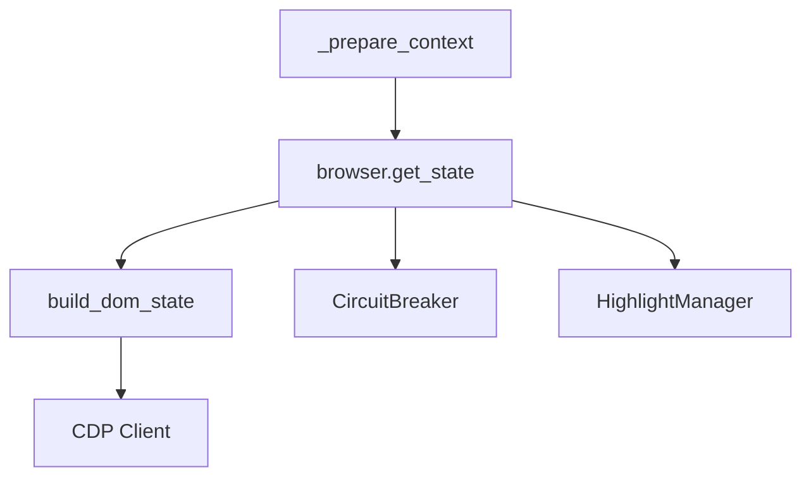

# 1-获取浏览器状态

> 源码位置: `src/tree_walker/agent/step.py` 第 127 行

## 📋 方法作用

调用 `browser.get_state(include_screenshot=True)` 获取完整的浏览器页面状态，包括 URL、标题、标签页列表、DOM 树和截图。这是整个 `_prepare_context()` 阶段最重的 I/O 操作。

## 🔄 主要逻辑流程

```
_prepare_context() (L127)
  │
  └── browser_state = await self.browser.get_state(include_screenshot=True)
        │
        ▼
  BrowserSession.get_state() (session.py L281-368)
    ├── 轮转 DOM 缓存: _previous ← _cached           (L286)
    ├── Runtime.evaluate → url + title                (L291-303)
    ├── Target.getTargets → tabs                      (L305-316)
    ├── DOM 状态构建                                    (L318-338)
    │   ├── 断路器检查 (is_open?) → EMPTY_DOM_STATE    (L319-322)
    │   ├── build_dom_state(client, ...)               (L325-329)
    │   │   └── CDP 批量采集: DOM + AX + Snapshot
    │   └── 断路器记录: success or failure              (L330-336)
    ├── 截图 (可选)                                    (L348-353)
    └── return BrowserStateSummary                     (L362-368)
```

## 🔍 详细步骤说明

### 1. DOM 缓存轮转 (session.py L286)

```python
self._previous_cached_selector_map = self._cached_selector_map
```

将当前缓存移动到"前一步"位置，用于新元素检测（DOM 树中标记 `[new]` 的新出现元素）。

### 2. URL 和标题获取 (session.py L291-303)

```python
result = await self.client.send.Runtime.evaluate({
    "expression": "JSON.stringify({url: location.href, title: document.title})",
    "returnByValue": True,
}, session_id=sid)
```

通过单个 JS 表达式同时获取 URL 和标题，减少 CDP 调用次数。

### 3. DOM 状态构建与断路器 (session.py L318-338)

```
断路器状态?
├─ is_open (已熔断)
│   └─ 返回 EMPTY_DOM_STATE（空 DOM，无交互元素）
└─ is_closed (正常)
    ├─ build_dom_state() → CDP 批量采集
    │   └─ 降级级别: FULL → PARTIAL → MINIMAL → FAILED
    └─ 更新断路器状态
        ├─ FAILED → record_failure()
        └─ 其他 → record_success()
```

**断路器阈值**：连续 3 次失败后熔断，30 秒后尝试恢复。保护 agent 在 DOM 采集反复失败时不阻塞主循环。

### 4. 截图 (session.py L348-353)

截图前移除高亮注入（避免干扰），截图后重新注入调试高亮。

## 🎯 设计亮点

1. **DOM 缓存轮转** — 保留前一步 selector_map，支持新元素检测
2. **断路器保护** — DOM 采集失败时优雅降级，返回空 DOM 而非崩溃
3. **高亮管理** — 截图前移除高亮、截图后恢复，保证截图纯净

## 📊 返回值结构

```python
BrowserStateSummary(
    url="https://example.com",
    title="Example",
    tabs=[TabInfo(target_id="...", url="...", title="...")],
    dom_state=SerializedDOMState(
        _root=SimplifiedNode(...),
        selector_map={0: EnhancedDOMTreeNode, 1: ...},
        element_tree_text="[0]<button>Submit\n[1]<input>...",
        file_input_backend_ids=[42],
    ),
    screenshot=b"\x89PNG...",
)
```

## 🔗 与其他方法的协作



| 协作对象 | 调用位置 | 说明 |
|---------|---------|------|
| `BrowserSession.get_state()` | step.py L127 | 获取完整页面状态 |
| `build_dom_state()` | session.py L325 | CDP DOM 批量采集 |
| `CircuitBreaker` | session.py L319-336 | DOM 采集断路器 |
| `HighlightManager` | session.py L342-359 | 截图前后高亮管理 |
