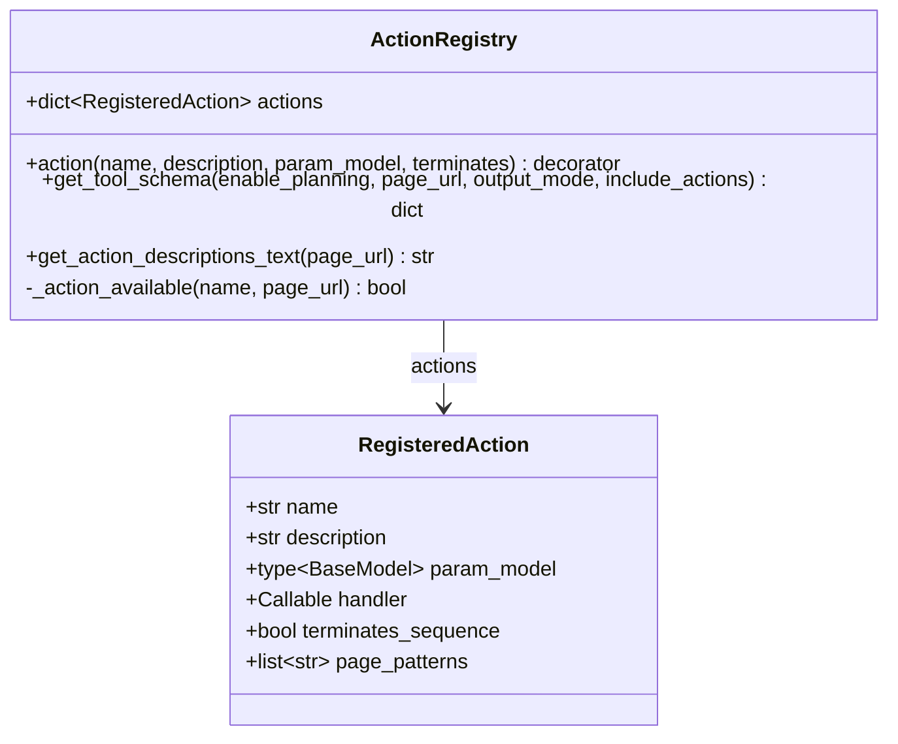

# ActionRegistry 类职责

> 源码文件: `src/tree_walker/tools/registry.py` (第 1-189 行)

## 📋 类作用

`ActionRegistry` 管理所有已注册动作的元数据，提供两种输出格式：Anthropic tool_use schema（给 LLM）和人类可读描述文本（给 system prompt）。支持按页面 URL 过滤动作、按输出模式调整 schema 结构。

## 🏗️ 类定义



## 📊 方法表格

| 方法 | 参数 | 返回类型 | 说明 |
|------|------|---------|------|
| `action` | name, description, param_model, terminates | decorator | 注册动作的装饰器工厂 |
| `get_tool_schema` | enable_planning, page_url, output_mode, include_actions | `dict` | 生成 Anthropic tool schema |
| `get_action_descriptions_text` | page_url | `str` | 生成人类可读动作列表 |
| `_action_available` | name, page_url | `bool` | 检查动作在当前页面是否可用 |

## 🔍 核心方法详解

### 1. **get_tool_schema** (第 59-171 行) — 生成 tool schema

三种输出模式：

```
get_tool_schema(output_mode="standard")
  ├── standard → {evaluation, memory, next_goal, action}       # 完整四字段
  ├── flash    → {action}                                       # 仅动作
  └── thinking → {thinking, evaluation, memory, next_goal, action}  # 额外思考字段

可选扩展:
  ├── enable_planning → 添加 plan_update, current_plan_item 字段
  ├── page_url → 过滤 page_patterns 匹配的动作
  └── include_actions → 限制动作白名单 (如强制 done-only)
```

### 2. **_action_available** (第 30-36 行) — 页面过滤

```python
def _action_available(self, name, page_url):
    if page_url is None: return True           # 无 URL → 全部可用
    action = self.actions[name]
    if action.page_patterns is None: return True  # 无过滤规则 → 可用
    return any(fnmatch(page_url, p) for p in action.page_patterns)
```

## 🎯 设计亮点

1. **单一 tool 模式** — 所有动作通过一个 `agent_response` tool 暴露，LLM 每次只做一次 tool call
2. **三种输出模式** — standard/flash/thinking，按需精简 LLM 输出
3. **页面级动作过滤** — 通过 glob 模式按 URL 启用/禁用特定动作
4. **动态 schema** — 最后一步或失败上限时可切换为 done-only schema

## 🔗 与其他类的协作

| 协作对象 | 协作方式 | 说明 |
|---------|---------|------|
| Tools | 组合 | Tools 持有 ActionRegistry 实例 |
| LLMClient | 间接 | schema 传入 `get_action()` |
| StepPipeline | 调用 | `get_tool_schema()` 和 `get_action_descriptions_text()` |
