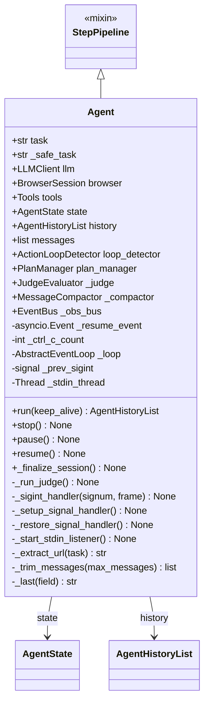
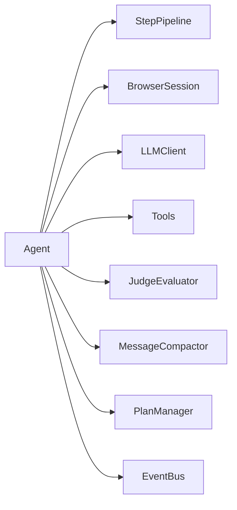

# Agent 类职责

> 源码文件: `src/tree_walker/agent/agent.py` (第 30-345 行)

## 📋 类作用

`Agent` 是 TreeWalker 的顶层编排类，继承自 `StepPipeline` 混入。负责 Agent 的**生命周期管理**（启动、暂停、恢复、停止）、**公共 API** 暴露、**信号处理**和**会话终结化**。单步执行的具体逻辑由 `StepPipeline` 提供。

## 🏗️ 类定义



## 📊 属性表格

| 属性 | 类型 | 可见性 | 说明 |
|------|------|--------|------|
| `task` | `str` | public | 原始用户任务描述 |
| `_safe_task` | `str` | private | 敏感数据替换后的安全任务描述 |
| `llm` | `LLMClient` | public | LLM 客户端实例 |
| `browser` | `BrowserSession` | public | 浏览器会话实例 |
| `tools` | `Tools` | public | 动作注册与执行引擎 |
| `state` | `AgentState` | public | Agent 运行时状态 |
| `history` | `AgentHistoryList` | public | 执行历史记录 |
| `messages` | `list[dict]` | public | LLM 对话消息列表 |
| `loop_detector` | `ActionLoopDetector` | public | 循环检测器 |
| `plan_manager` | `PlanManager | None` | public | 计划管理器（可选） |
| `_judge` | `JudgeEvaluator | None` | private | Judge 评估器（可选） |
| `_compactor` | `MessageCompactor | None` | private | 消息压缩器（可选） |
| `_resume_event` | `asyncio.Event` | private | 暂停/恢复信号 |
| `_ctrl_c_count` | `int` | private | Ctrl+C 按下次数 |
| `_obs_bus` | `EventBus | None` | private | 可观测性事件总线 |

## 📊 方法表格

| 方法 | 参数 | 返回类型 | 可见性 | 说明 |
|------|------|---------|--------|------|
| `__init__` | task, llm, browser, tools, settings, sensitive_data | None | public | 初始化所有子系统 |
| `run` | keep_alive=False | AgentHistoryList | public | 主循环入口 |
| `stop` | — | None | public | 停止 Agent |
| `pause` | — | None | public | 暂停 Agent |
| `resume` | — | None | public | 恢复 Agent |
| `_finalize_session` | — | None | private | 发射 SessionEndEvent 并关闭 EventBus |
| `_run_judge` | — | None | private | 运行 Judge 评估 |
| `_sigint_handler` | signum, frame | None | private | Ctrl+C 信号处理 |
| `_setup_signal_handler` | — | None | private | 注册 SIGINT handler |
| `_restore_signal_handler` | — | None | private | 恢复原 SIGINT handler |
| `_start_stdin_listener` | — | None | private | 启动 stdin 监听线程 |
| `_extract_url` | task | str | static | 从任务中提取 URL |
| `_trim_messages` | max_messages=20 | list | private | 修剪消息列表 |
| `_last` | field | str | private | 获取上次 LLM 输出字段 |

## 🔍 核心方法详解

### 1. **__init__** (第 44-153 行)

初始化全部子系统。关键初始化顺序：

```python
# 1. 基础赋值 (L44-65)
self.task = task
self.llm = llm
self.browser = browser
# ... settings 解析

# 2. 状态对象 (L67-73)
self.state = AgentState()
self.history = AgentHistoryList()
self.loop_detector = ActionLoopDetector()
self.messages = []

# 3. 可选子系统 (L70-143)
self._compactor = MessageCompactor(...) if enabled
self.plan_manager = PlanManager() if enabled
self._judge = JudgeEvaluator(llm) if enabled
self._obs_bus = EventBus() if enabled

# 4. 提示构建 (L145-153)
self._system_prompt = build_system_prompt(...)
self._tool_schema = self.tools.registry.get_tool_schema(...)
```

### 2. **run** (第 184-231 行)

主循环入口，负责完整的 Agent 生命周期：

```
run(keep_alive=False)
  ├── browser.start(track_downloads)          # L186
  ├── _extract_url(task) → navigate()         # L188-193
  ├── _setup_signal_handler()                 # L195
  │
  ├── while n_steps <= max_steps:             # L197
  │   ├── 检查 stopped / max_failures          # L198-207
  │   ├── 暂停等待 (if paused)                 # L210-214
  │   ├── _step() → done?                     # L217-221
  │   │   └── _run_judge() if done + judge    # L219-220
  │   └── KeyboardInterrupt → break           # L222-224
  │
  └── finally:                                # L225-230
      ├── _finalize_session()                 # L226
      ├── _restore_signal_handler()           # L227
      └── browser.stop() (unless keep_alive)  # L228-229
```

### 3. **pause / resume / stop** (第 233-248 行)

通过 `asyncio.Event` 实现协作式暂停/恢复：

- `pause()` — `state.paused=True` + `_resume_event.clear()`
- `resume()` — `state.paused=False` + `_resume_event.set()`
- `stop()` — `state.stopped=True` + `_resume_event.set()`（唤醒等待中的 run）

### 4. **_finalize_session** (第 157-182 行)

会话结束时发射可观测性事件：

- 计算 metrics_summary、has_done、total_duration
- 调用 `SessionEvaluator.evaluate()` 生成评估
- 发射 `SessionEndEvent`
- 关闭 EventBus

## 🎯 设计亮点

1. **Mixin 分层** — `StepPipeline` 提供单步管线，`Agent` 负责生命周期，职责清晰互不干扰
2. **协作式暂停** — 使用 `asyncio.Event` 而非线程锁，暂停时仍可响应 stdin
3. **SIGINT 渐进处理** — 第一次 Ctrl+C 暂停，第二次停止，避免误操作
4. **可选子系统** — Judge、Compactor、Plan、Observability 都是可选的，通过 settings 开关

## 🔗 与其他类的协作



| 协作对象 | 协作方式 | 说明 |
|---------|---------|------|
| StepPipeline | 继承 | 提供五阶段管线 `_step()` |
| BrowserSession | 组合 | `run()` 中调用 `start()/stop()` |
| LLMClient | 组合 | 传递给 StepPipeline 用于 LLM 调用 |
| JudgeEvaluator | 可选组合 | `run()` 完成后调用 `_run_judge()` |
| MessageCompactor | 可选组合 | `_step()` 中调用 `maybe_compact()` |
| EventBus | 可选组合 | 各阶段发射事件 |
