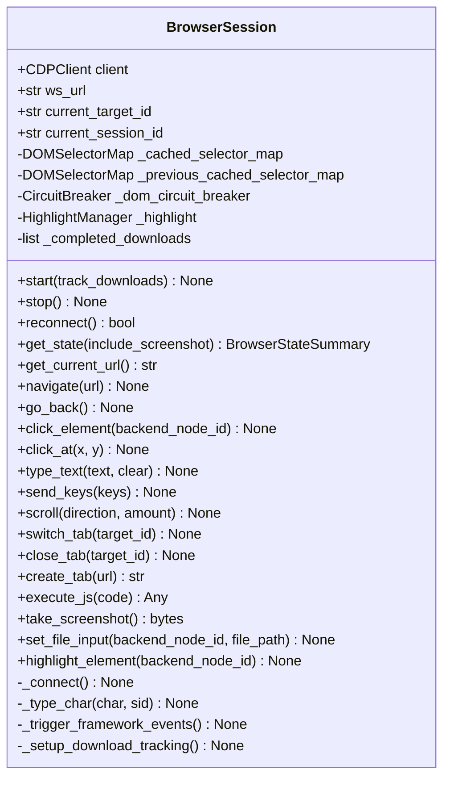

# BrowserSession 类职责

> 源码文件: `src/tree_walker/browser/session.py` (第 123-865 行)

## 📋 类作用

`BrowserSession` 通过 CDP（Chrome DevTools Protocol）WebSocket 连接浏览器，提供高级页面操作接口（导航、点击、输入、滚动、Tab 管理等）。管理 DOM 缓存、断路器保护、下载追踪和高亮管理。

## 🏗️ 类定义



## 📊 方法表格

| 方法 | 分类 | 参数 | 返回类型 | 说明 |
|------|------|------|---------|------|
| `start` | 生命周期 | track_downloads | None | CDP 连接 + 下载追踪 |
| `stop` | 生命周期 | — | None | 断开连接 |
| `reconnect` | 生命周期 | — | bool | 重连浏览器 |
| `get_state` | 状态 | include_screenshot | BrowserStateSummary | 获取完整页面状态 |
| `navigate` | 导航 | url | None | 页面导航 |
| `go_back` | 导航 | — | None | 历史后退 |
| `click_element` | 交互 | backend_node_id | None | 通过 CDP 点击元素 |
| `type_text` | 交互 | text, clear | None | 逐字符输入 |
| `send_keys` | 交互 | keys | None | 发送组合键 |
| `scroll` | 交互 | direction, amount | None | 滚动页面 |
| `execute_js` | JS | code | Any | 执行 JavaScript |
| `set_file_input` | 文件 | backend_node_id, file_path | None | 设置文件输入 |

## 🔍 核心方法详解

### 1. **start** (第 159-165 行) — 连接浏览器

```
start(track_downloads=False)
  ├── CDPClient(ws_url)           # 创建 CDP 客户端
  ├── _connect()                  # 连接 + 发现 target
  │   ├── client.start()
  │   ├── Target.getTargets() → 找到 page target
  │   ├── Target.attachToTarget() → 获取 session_id
  │   ├── Page.enable() + DOM.enable()
  │   ├── Target.setAutoAttach() → iframe 发现
  │   └── HighlightManager 配置
  └── _setup_download_tracking()  # (可选)
```

### 2. **get_state** (第 281-368 行) — 获取页面状态

```
get_state(include_screenshot=True) → BrowserStateSummary
  ├── 轮转缓存: previous ← current     # L286
  ├── Runtime.evaluate → url, title     # L291-303
  ├── Target.getTargets → tabs          # L305-316
  ├── DOM 状态构建                       # L318-338
  │   ├── 断路器检查 (is_open?)
  │   ├── build_dom_state(client, ...)
  │   └── 断路器记录 (success/failure)
  ├── 截图 (可选)                        # L348-353
  └── return BrowserStateSummary(...)
```

### 3. **type_text** (第 530-561 行) — 逐字符输入

关键设计：**逐字符 CDP keyDown→char→keyUp**，确保框架事件触发：

```python
async def type_text(self, text, clear=False):
    if clear:
        # Ctrl+A → Backspace (L539-554)
    for char in text:
        await self._type_char(char, sid)   # 逐字符输入
        await asyncio.sleep(0.001)          # 1ms 间隔
    await self._trigger_framework_events()  # 框架事件兼容
```

### 4. **_trigger_framework_events** (第 604-669 行) — 框架兼容

输入后触发 `InputEvent('input')` + `Event('change')` + `Event('blur')` + Vue 特殊处理，确保 React/Vue 响应式系统感知到值变化。

### 5. **click_element** (第 507-528 行) — 三级坐标获取

```
click_element(backend_node_id)
  ├── DOM.scrollIntoViewIfNeeded()
  ├── get_element_coordinates()  → 三级降级:
  │   ├── DOM.getContentQuads       → 最佳
  │   ├── DOM.getBoxModel           → 次选
  │   └── JS getBoundingClientRect  → 兜底
  └── click_at(center_x, center_y)
```

## 🎯 设计亮点

1. **DOM 双层缓存** — `_cached_selector_map` + `_previous_cached_selector_map`，支持新元素检测
2. **断路器保护** — DOM 采集连续失败 3 次后进入断路状态，避免雪崩
3. **框架事件兼容** — 输入后触发标准 DOM 事件 + Vue 特殊处理
4. **三级坐标获取** — ContentQuads → BoxModel → JS getBoundingClientRect
5. **Shadow DOM 文件输入** — 通过 `DOM.getDocument(pierce=True)` 遍历 shadow DOM 找到 file input

## 🔗 与其他类的协作

| 协作对象 | 协作方式 | 说明 |
|---------|---------|------|
| CDPClient | 组合 | WebSocket CDP 协议通信 |
| HighlightManager | 组合 | 元素高亮反馈 |
| CircuitBreaker | 组合 | DOM 采集断路器 |
| Tools | 被调用 | 动作执行时使用浏览器操作 |
| StepPipeline | 被调用 | `_prepare_context()` 和 `_execute_actions()` |
