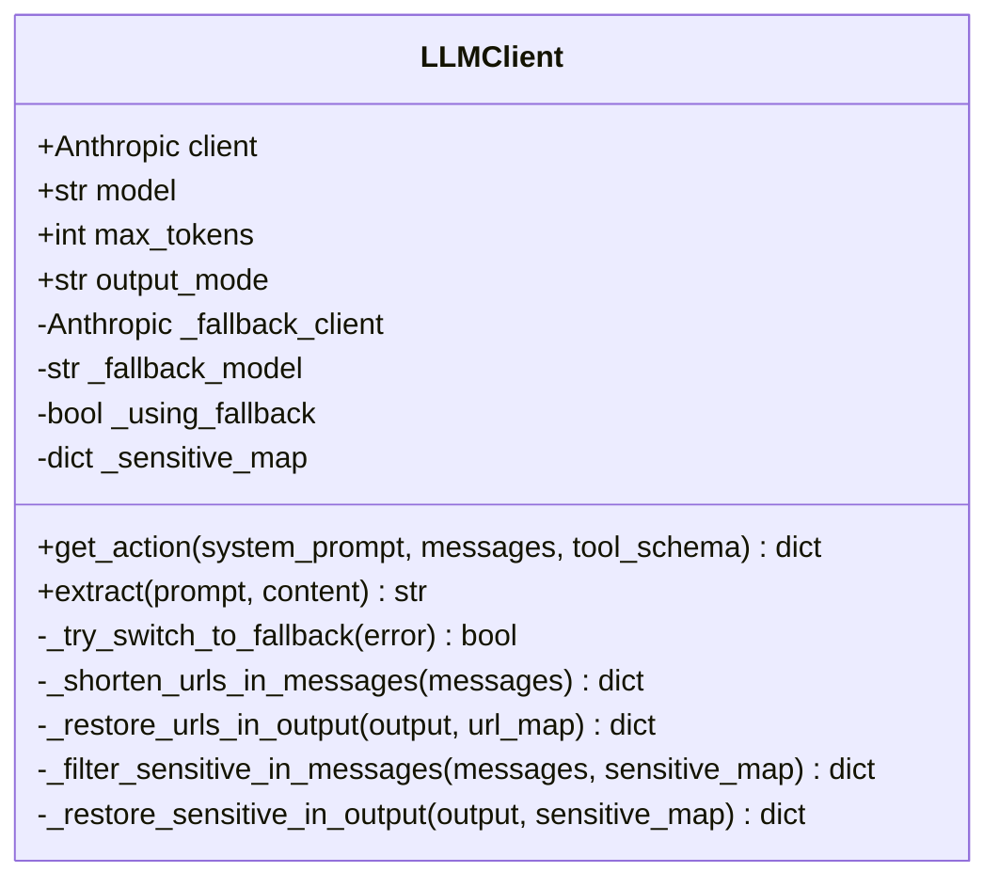

# LLMClient 类职责

> 源码文件: `src/tree_walker/llm/client.py` (第 20-309 行)

## 📋 类作用

`LLMClient` 封装 Anthropic SDK，使用 `tool_use` 模式与 LLM 交互。提供动作决策调用（`get_action`）和文本提取调用（`extract`）两种能力。内置 URL 压缩、敏感数据过滤、Fallback LLM 切换和响应解析降级链。

## 🏗️ 类定义



## 📊 属性表格

| 属性 | 类型 | 说明 |
|------|------|------|
| `client` | `Anthropic` | 主 LLM API 客户端 |
| `model` | `str` | 当前使用的模型 ID |
| `max_tokens` | `int` | 最大生成 token 数 |
| `output_mode` | `str` | 输出模式：standard/flash/thinking |
| `_fallback_client` | `Anthropic | None` | 备用 LLM 客户端 |
| `_using_fallback` | `bool` | 是否已切换到备用 |

## 📊 方法表格

| 方法 | 参数 | 返回类型 | 说明 |
|------|------|---------|------|
| `__init__` | settings, **overrides | None | 初始化主/备用客户端 |
| `get_action` | system_prompt, messages, tool_schema | `dict` | 调用 LLM 获取动作决策 |
| `extract` | prompt, content | `str` | 调用 LLM 提取页面信息 |
| `_try_switch_to_fallback` | error | `bool` | 切换到备用 LLM（单向） |
| `_shorten_urls_in_messages` | messages | `dict` | URL 压缩 |
| `_restore_urls_in_output` | output, url_map | `dict` | URL 恢复 |
| `_filter_sensitive_in_messages` | messages, sensitive_map | `dict` | 敏感数据替换 |
| `_restore_sensitive_in_output` | output, sensitive_map | `dict` | 敏感数据恢复 |

## 🔍 核心方法详解

### 1. **get_action** (第 165-260 行)

完整的 LLM 调用链：

```
get_action(system_prompt, messages, tool_schema)
  ├── _shorten_urls_in_messages()           # L173 — URL 压缩
  ├── _filter_sensitive_in_messages()       # L176-177 — 敏感数据过滤
  │
  ├── client.messages.create(               # L180-187 — API 调用
  │     tools=[tool_schema],
  │     tool_choice={"type": "tool", "name": "agent_response"}
  │   )
  │   └── RateLimitError/APIError → _try_switch_to_fallback() → 重试
  │
  ├── 响应解析降级链                         # L200-224
  │   ├── 1. 提取 tool_use block            # L201-204
  │   ├── 2. 文本 JSON 解析                 # L207-216
  │   └── 3. 文本 → 重试一次                # L218-223
  │
  ├── fallback done（空响应）                # L225-238
  │
  ├── _restore_urls_in_output()             # L253-254
  └── _restore_sensitive_in_output()        # L257-258
```

### 2. **_try_switch_to_fallback** (第 57-69 行)

单向切换机制 — 一旦切换到备用 LLM，不会再切回：

```python
def _try_switch_to_fallback(self, error):
    if self._using_fallback or not self._fallback_client:
        return False
    self.client = self._fallback_client      # 替换客户端
    self.model = self._fallback_model        # 替换模型
    self._using_fallback = True              # 标记已切换
    return True
```

### 3. **URL 压缩** (第 71-103 行)

将消息中 >=100 字符的 URL 替换为 `[u0]`、`[u1]` 等标记：

- 相同 URL 共享标记，节省 token
- LLM 输出后通过 `_restore_urls_in_output()` 递归恢复

## 🎯 设计亮点

1. **响应解析降级链** — tool_use → JSON parse → retry → fallback，最大化 LLM 响应利用率
2. **单向 Fallback** — 避免在主/备用间反复切换造成的抖动
3. **URL 压缩** — 长 URL 共享标记，显著减少 token 消耗
4. **敏感数据双向过滤** — 发送前替换 + 输出后恢复，LLM 永远看不到真实敏感值

## 🔗 与其他类的协作

| 协作对象 | 协作方式 | 说明 |
|---------|---------|------|
| StepPipeline | 被调用 | `_get_next_action()` → `get_action()` |
| ActionRegistry | 间接 | `get_tool_schema()` 生成 tool_schema 传入 |
| Agent | 组合 | 初始化时传入，设置 `_sensitive_map` |
