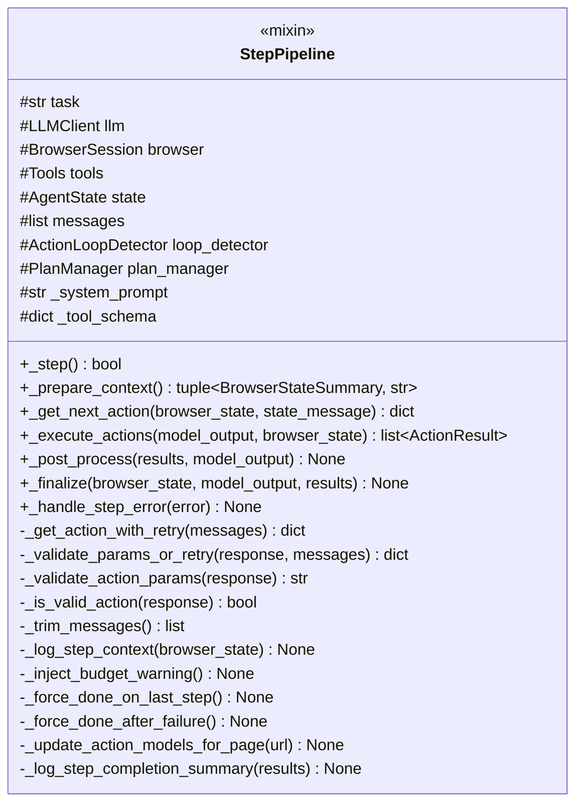
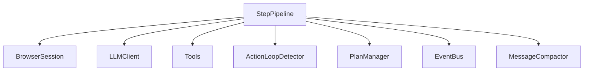

# StepPipeline 类职责

> 源码文件: `src/tree_walker/agent/step.py` (第 41-757 行)

## 📋 类作用

`StepPipeline` 是一个**混入类（Mixin）**，为 `Agent` 提供五阶段单步执行管线。每个 `_step()` 调用执行一个完整的 Sense-Think-Act 循环，包含：准备上下文、LLM 决策、动作执行、后处理、终结化。

## 🏗️ 类定义



## 📊 方法表格

| 方法 | 阶段 | 参数 | 返回类型 | 说明 |
|------|------|------|---------|------|
| `_step` | 编排器 | — | `bool` | 五阶段编排，返回是否完成 |
| `_prepare_context` | Phase 1 | — | `tuple` | 获取浏览器状态 + 构建状态消息 |
| `_get_next_action` | Phase 2 | browser_state, state_message | `dict` | LLM 决策 + 重试 |
| `_execute_actions` | Phase 3 | model_output, browser_state | `list[ActionResult]` | 执行动作 + 超时保护 |
| `_post_process` | Phase 4 | results, model_output | `None` | 更新状态、循环检测、计划 |
| `_finalize` | Phase 5 | browser_state, model_output, results | `None` | 记录历史、发射事件、步数+1 |
| `_handle_step_error` | 异常 | error | `None` | 三分支错误处理 |
| `_get_action_with_retry` | Phase 2 | messages | `dict` | LLM 空动作重试 + 参数校验 |
| `_validate_params_or_retry` | Phase 2 | response, messages | `dict` | Pydantic 参数校验 + 重试 |

## 🔍 核心方法详解

### 1. **_step** (第 72-111 行) — 编排器

```python
async def _step(self) -> bool:
    self._step_start_time = time.time()
    # 发射 StepStartEvent (L75-79)

    try:
        browser_state, state_message = await self._prepare_context()   # Phase 1
        # 消息压缩 (L86-87)
        # 清除上次状态 (L94-95)
        model_output = await self._get_next_action(browser_state, ...) # Phase 2
        results = await self._execute_actions(model_output, ...)       # Phase 3
        self._post_process(results, model_output)                      # Phase 4

        if any(r.is_done for r in results): return True               # L101-102
    except Exception as e:
        await self._handle_step_error(e)                               # 异常处理
        return False
    finally:
        self._finalize(browser_state, model_output, results)           # Phase 5

    return False
```

### 2. **_prepare_context** (第 124-193 行) — Phase 1

7 个子步骤的完整上下文准备：

1. **获取浏览器状态** (L127) — `browser.get_state(include_screenshot=True)`
2. **日志记录** (L130) — URL、交互元素数
3. **循环检测记录** (L136) — `loop_detector.record_page(url)`
4. **计划上下文** (L139-153) — plan_description + planning_nudge（如果启用）
5. **构建状态消息** (L169-182) — `build_state_message(...)` → 追加到 messages
6. **预算警告** (L185) — >=75% 步数使用时注入
7. **强制 done** (L188-191) — 最后一步或连续失败达到上限时

### 3. **_get_next_action** (第 292-361 行) — Phase 2

```python
async def _get_next_action(self, browser_state, state_message) -> dict:
    trimmed = self._trim_messages()         # L298 — 消息修剪
    # 发射 ModelCallEvent (L306-312)

    response = await asyncio.wait_for(      # L315-318 — LLM 超时保护
        self._get_action_with_retry(trimmed),
        timeout=self.llm_timeout,
    )

    # 发射 ModelResultEvent (L325-333)
    # 记录 assistant 消息 (L336-343)
    # 结构化日志 (L349-357)
    return response
```

### 4. **_execute_actions** (第 490-556 行) — Phase 3

```python
async def _execute_actions(self, model_output, browser_state) -> list:
    # 检查 stopped/paused (L503-504)
    # 解析 action_name, action_params (L506-508)
    # 发射 ToolCallEvent (L511-520)

    try:
        result = await asyncio.wait_for(    # L525-528 — 动作超时
            self.tools.execute(action_name, params, self.browser, browser_state),
            timeout=self.action_timeout,
        )
    except asyncio.TimeoutError → ActionResult(error=...)
    except Exception (非连接) → ActionResult(error=...)
    except Exception (连接) → raise  # 向上传播触发重连

    # 发射 ToolResultEvent (L539-546)
    # URL 变化检测 (L548-554)
    return [result]
```

### 5. **_post_process** (第 560-611 行) — Phase 4

```
_post_process(results, model_output)
  ├── state.last_result = results             # L574
  ├── state.last_model_output = model_output  # L575
  ├── plan_manager.update_from_model_output() # L578-579 (可选)
  ├── loop_detector.record_action()           # L582-586 (豁免过滤)
  ├── 失败计数管理                             # L589-596
  │   ├── 单动作错误 → +1, early return
  │   └── 成功 → 重置为 0
  └── 完成 logging (颜色编码)                  # L599-610
```

### 6. **_finalize** (第 614-651 行) — Phase 5

始终在 `finally` 中执行：

```
_finalize(browser_state, model_output, results)
  ├── history.history.append(AgentHistory(...))  # L625-638 (if model_output)
  ├── 发射 StepEndEvent                          # L640-648 (if _obs_bus)
  ├── _log_step_completion_summary()             # L650
  └── state.n_steps += 1                         # L651 (最后执行)
```

### 7. **_handle_step_error** (第 670-710 行) — 三分支错误处理

```python
async def _handle_step_error(self, error):
    # 分支 1: 用户中断 → 不计数
    if isinstance(error, InterruptedError): return    # L679-680

    # 分支 2: 连接错误 → 重连循环
    if _is_connection_error(error):                   # L684-696
        for _ in range(reconnect_timeout):
            if await browser.reconnect(): return
        state.stopped = True  # 重连失败

    # 分支 3: 其他错误 → 失败计数
    state.consecutive_failures += 1                   # L699-710
```

## 🎯 设计亮点

1. **五阶段管线** — 每个 Phase 有清晰的输入输出，可独立测试
2. **finally 保证终结** — `_finalize()` 始终执行，确保历史记录不丢失
3. **超时分层** — LLM 超时（`llm_timeout`）和动作超时（`action_timeout`）独立控制
4. **参数校验重试** — Pydantic 校验失败后自动重试，减少 LLM 格式错误导致的浪费
5. **URL 变化检测** — 动作前后比较 URL，感知页面导航

## 🔗 与其他类的协作



| 协作对象 | 协作方式 | 阶段 |
|---------|---------|------|
| BrowserSession | `get_state()` | Phase 1 |
| LLMClient | `get_action()` | Phase 2 |
| Tools | `execute()` | Phase 3 |
| ActionLoopDetector | `record_action/record_page()` | Phase 1, 4 |
| PlanManager | `update_from_model_output()` | Phase 4 |
| EventBus | `emit()` | Phase 1, 2, 3, 5 |
| MessageCompactor | `maybe_compact()` | Phase 1 |
