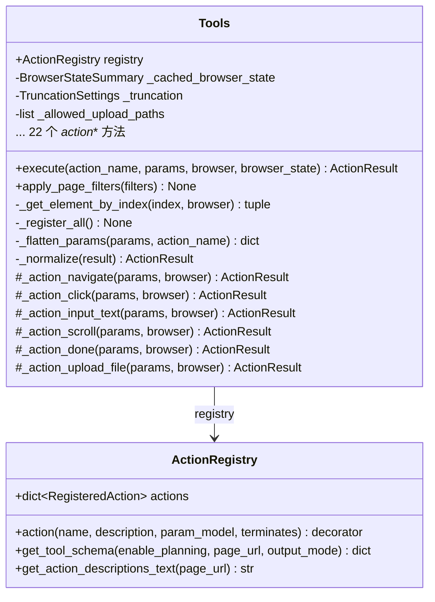

# Tools 类职责

> 源码文件: `src/tree_walker/tools/actions.py` (第 110-506 行)

## 📋 类作用

`Tools` 是动作注册与执行引擎。在构造时通过 `ACTION_DEFINITIONS` 自动注册 22 个浏览器动作，每个动作关联一个 Pydantic 参数模型和异步 handler。执行时负责参数展平、元素查找、动作分发和结果规范化。

## 🏗️ 类定义



## 📊 动作列表

| 动作名 | 参数模型 | 导航类 | 说明 |
|--------|---------|--------|------|
| `navigate` | NavigateParams | ✅ | 导航到 URL |
| `click` | ClickParams | ❌ | 通过 ID 点击元素 |
| `input_text` | InputTextParams | ❌ | 在输入框中输入文本 |
| `scroll` | ScrollParams | ❌ | 滚动页面 |
| `search` | SearchParams | ✅ | 搜索引擎搜索 |
| `extract` | ExtractParams | ❌ | 从页面提取信息 |
| `send_keys` | SendKeysParams | ❌ | 发送组合键 |
| `switch_tab` | SwitchTabParams | ✅ | 切换 Tab |
| `close_tab` | CloseTabParams | ❌ | 关闭 Tab |
| `wait` | WaitParams | ❌ | 等待指定秒数 |
| `go_back` | GoBackParams | ✅ | 历史后退 |
| `find_elements` | FindElementsParams | ❌ | CSS 选择器查找 |
| `find_text` | FindTextParams | ❌ | 页面文本搜索 |
| `screenshot` | ScreenshotParams | ❌ | 截图 |
| `save_as_pdf` | SaveAsPdfParams | ❌ | 保存为 PDF |
| `dropdown_options` | DropdownOptionsParams | ❌ | 获取下拉选项 |
| `select_dropdown` | SelectDropdownParams | ❌ | 选择下拉选项 |
| `upload_file` | UploadFileParams | ❌ | 上传文件 |
| `write_file` | WriteFileParams | ❌ | 写入本地文件 |
| `read_file` | ReadFileParams | ❌ | 读取本地文件 |
| `replace_file` | ReplaceFileParams | ❌ | 替换文件内容 |
| `evaluate` | EvaluateParams | ✅ | 执行 JS 代码 |
| `search_page` | SearchPageParams | ❌ | 页面内文本搜索 |
| `done` | DoneParams | ❌ | 任务完成信号 |

## 🔍 核心方法详解

### 1. **execute** (第 126-148 行) — 动作执行入口

```
execute(action_name, params, browser, browser_state) → ActionResult
  ├── 检查 action_name 是否已注册           # L134-135
  ├── _flatten_params(params, action_name)  # L137 — 参数展平
  ├── 缓存 browser_state                    # L139
  ├── registry.actions[name].handler(...)   # L141-142 — 调用 handler
  ├── _normalize(result)                    # L143 — 统一为 ActionResult
  └── 清除缓存 (finally)                    # L148
```

### 2. **_get_element_by_index** (第 152-167 行) — 元素查找

优先从缓存的 DOM 状态查找，避免重复 CDP 调用：

```python
async def _get_element_by_index(self, index, browser):
    # 优先缓存查找 (L156-159)
    if self._cached_browser_state and self._cached_browser_state.dom_state:
        entry = self._cached_browser_state.dom_state.selector_map.get(index)
        if entry: return entry, None

    # 回退到实时获取 (L161-166)
    state = await browser.get_state(include_screenshot=False)
    entry = state.dom_state.selector_map.get(index)
    ...
```

### 3. **_action_upload_file** (第 359-421 行) — 文件上传

智能文件输入查找：

```
_upload_file(params, browser)
  ├── 路径安全检查 (allowed_upload_paths)
  ├── 元素查找 → _get_element_by_index()
  ├── 检查是否为 <input type="file">
  ├── 非文件输入 → 查找页面上的 file input
  │   ├── DOM 状态中的 file_input_backend_ids
  │   └── _pick_nearest_file_input() → 最近文件输入
  │       ├── DOM 树遍历 (parent/sibling/descendants)
  │       └── 坐标距离 fallback
  └── browser.set_file_input(backend_id, file_path)
```

## 🎯 设计亮点

1. **声明式注册** — `ACTION_DEFINITIONS` 定义参数模型+描述，`_register_all()` 自动绑定 handler
2. **缓存加速** — 复用 `_step()` 阶段的 browser_state，避免重复 DOM 查询
3. **智能文件上传** — DOM 树遍历 + 坐标距离双重策略找到最近的 file input
4. **参数展平** — 兼容 LLM 输出的嵌套参数格式 `{"click": {"index": 5}}`
5. **安全路径控制** — `allowed_upload_paths` 限制文件上传范围

## 🔗 与其他类的协作

| 协作对象 | 协作方式 | 说明 |
|---------|---------|------|
| ActionRegistry | 组合 | 动作注册、schema 生成 |
| BrowserSession | 参数传入 | 动作执行时使用浏览器操作 |
| StepPipeline | 被调用 | `_execute_actions()` → `tools.execute()` |
| Pydantic Models | 数据 | 每个动作的参数校验模型 |
