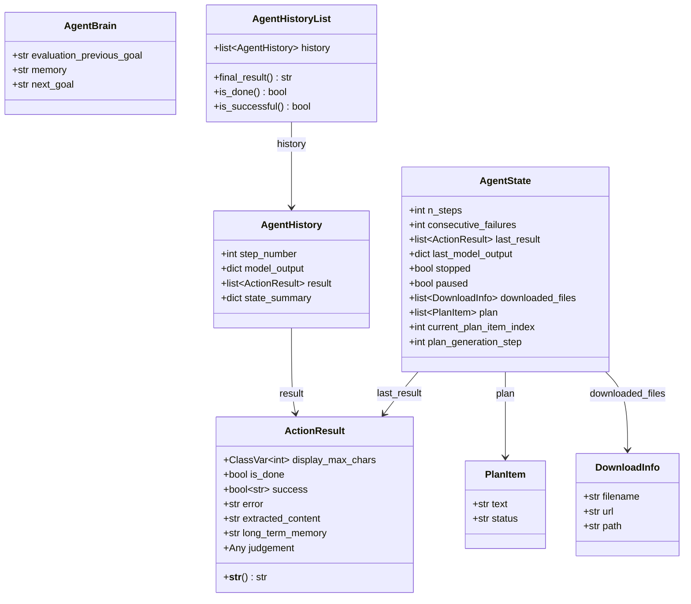

# 数据模型类职责

> 源码文件: `src/tree_walker/agent/views.py` (第 1-102 行)

## 📋 类作用

`views.py` 定义了 Agent 层的核心数据模型，包括动作结果（`ActionResult`）、计划项（`PlanItem`）、Agent 思维（`AgentBrain`）、运行状态（`AgentState`）和执行历史（`AgentHistory` / `AgentHistoryList`）。

## 🏗️ 类定义

## 📊 关键模型说明

### ActionResult

动作执行结果的统一容器：

| 属性 | 类型 | 说明 |
|------|------|------|
| `is_done` | `bool` | 任务是否完成 |
| `success` | `bool | None` | 是否成功（仅 is_done=True 时可设） |
| `error` | `str | None` | 错误信息 |
| `extracted_content` | `str | None` | 提取的内容 |
| `judgement` | `Any` | Judge 评估结果 |

校验规则：`success=True` 只能在 `is_done=True` 时设置。

### AgentState

Agent 运行时状态，贯穿整个执行过程：

| 属性 | 说明 |
|------|------|
| `n_steps` | 已执行步数 |
| `consecutive_failures` | 连续失败计数 |
| `stopped` / `paused` | 控制流标志 |
| `last_result` / `last_model_output` | 上一步结果 |
| `plan` | 当前计划列表 |
| `downloaded_files` | 已下载文件列表 |

### AgentHistoryList

执行历史的容器和查询接口：

- `final_result()` — 返回最后一个 done 动作的 extracted_content
- `is_done()` — 最后一步是否已完成
- `is_successful()` — 最后一步是否成功完成
