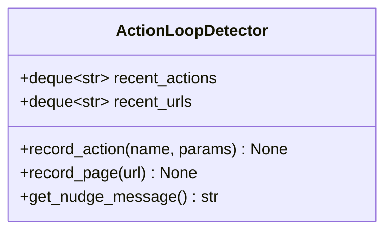
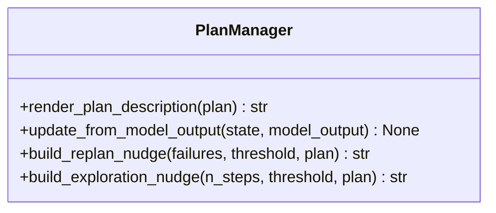
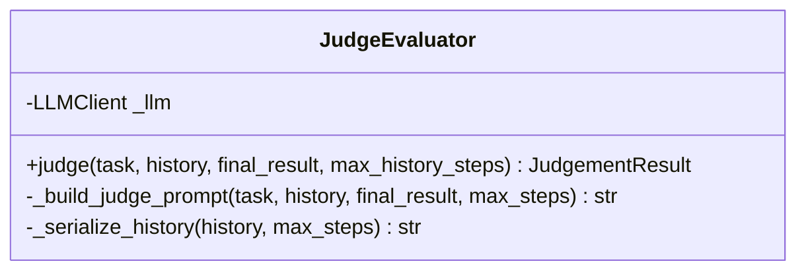
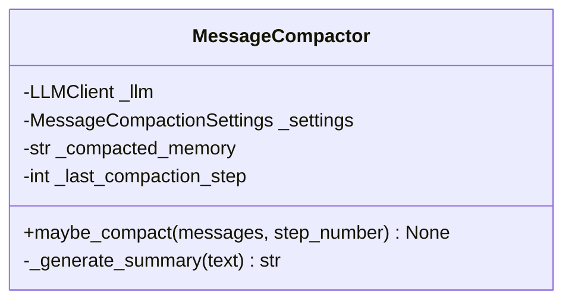

# 辅助系统类职责

> 包含 ActionLoopDetector、PlanManager、JudgeEvaluator、MessageCompactor

---

## ActionLoopDetector

> 源码文件: `src/tree_walker/agent/loop_detector.py` (第 9-53 行)

### 📋 类作用

软循环检测器 — 追踪最近动作和页面 URL，当检测到重复动作时生成分级 nudge 消息注入 LLM 上下文，**不阻断动作执行**。

### 🏗️ 类定义



### 📊 分级策略

| 重复次数 | 级别 | nudge 内容 |
|---------|------|-----------|
| 5-7 | WARNING | "Consider whether you are making progress" |
| 8-11 | WARNING+ | "You are likely stuck in a loop" |
| 12+ | CRITICAL | "You must immediately try a completely different approach" |

### 🎯 设计亮点

- **软干预** — 只生成 nudge 消息，不阻断动作
- **参数过滤** — 哈希时排除 `text` 和 `clear` 参数（内容必然不同）
- **豁免列表** — `wait`、`done`、`go_back` 不参与循环检测

---

## PlanManager

> 源码文件: `src/tree_walker/agent/plan_manager.py` (第 13-89 行)

### 📋 类作用

无状态的计划管理服务 — 负责计划渲染、更新和 nudge 生成。计划数据存储在 `AgentState` 中，PlanManager 只提供操作方法。

### 🏗️ 类定义



### 📊 计划更新路径

两条互斥路径：
- **路径 A: plan_update** — 替换整个计划，重置索引
- **路径 B: current_plan_item** — 推进当前步骤，中间步骤标记 done

### 🎯 设计亮点

- **无状态** — 计划数据存在 AgentState，PlanManager 纯方法
- **双 nudge 机制** — 探索引导（无计划时）+ 重规划引导（失败时）

---

## JudgeEvaluator

> 源码文件: `src/tree_walker/agent/judge.py` (第 73-194 行)

### 📋 类作用

独立 LLM Judge — 在 Agent 完成任务后，用独立的 LLM 调用审查执行轨迹，判断任务是否真正完成。

### 🏗️ 类定义



### 📊 执行流程

```
judge(task, history, final_result)
  ├── _build_judge_prompt()
  │   ├── _serialize_history() → 轨迹文本
  │   └── 构建评估提示
  ├── LLM API 调用 (tool_use 模式)
  └── 返回 JudgementResult {verdict, reasoning, failure_reason, impossible_task}
```

### 🎯 设计亮点

- **不信任自我报告** — Judge 独立验证，不盲信 Agent 的 success 标记
- **轨迹采样** — 超过 max_steps 时只保留前 3 步 + 最后 N 步
- **不可能任务检测** — `impossible_task` 标志区分失败和不可行

---

## MessageCompactor

> 源码文件: `src/tree_walker/agent/message_compactor.py` (第 22-121 行)

### 📋 类作用

消息压缩器 — 当对话历史过长时，用 LLM 将旧消息压缩为摘要，减少 token 消耗。

### 🏗️ 类定义



### 📊 双门控机制

```
maybe_compact(messages, step_number)
  ├── 门控 1: 步数间隔检查
  │   └── steps_since < compact_every_n_steps → return
  ├── 门控 2: 字符数检查
  │   └── total_chars < trigger_char_count → return
  │
  ├── 构建压缩输入 (previous_memory + conversation_history)
  ├── _generate_summary() → LLM 摘要
  │
  └── 替换消息列表: [first, summary_msg, *tail(N)]
```

### 🎯 设计亮点

- **双门控** — 步数 + 字符数，避免频繁压缩
- **增量压缩** — 新摘要包含前一次压缩结果，保留上下文连续性
- **保留尾部** — 保留最近 N 条原始消息，确保近期信息精确
