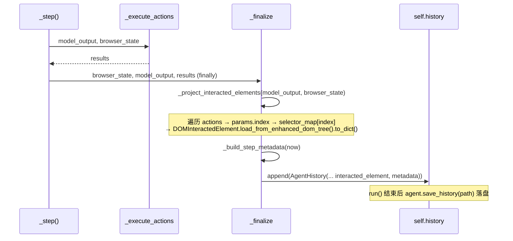

# 02 · 录制改造

> 目标：在现有 agent loop 里，把「每个动作当年点的元素」和「步骤计时」一并录进 `AgentHistory`，并提供 `save_history` 落盘入口。

## 1. 录制点在哪里

TreeWalker 的单步流水线在 `src/tree_walker/agent/step.py`（`StepPipeline` mixin）。一个 step 的五阶段：

```
_step() [step.py:94]
  ├─ Stage 1: _prepare_context()   → browser_state（含 dom_state.selector_map）+ state_message
  ├─ Stage 2: _get_next_action()   → model_output（dict）
  ├─ Stage 3: _execute_actions()   → results
  ├─ Stage 4: _post_process()
  └─ Stage 5: _finalize(browser_state, model_output, results)   ← 录制点
```

`_finalize`（`step.py:752`）已经在 `finally` 块里追加历史，且入参**已经持有** `browser_state` 和 `model_output`——我们只需在追加前补投影。

### 1.1 现有 `_finalize`（节选）

```python
# step.py:752
def _finalize(self, browser_state, model_output, results) -> None:
    if model_output is not None:
        state_summary = None
        if browser_state:
            state_summary = {
                "url": browser_state.url,
                "title": browser_state.title,
                "duration": time.time() - self._step_start_time,
            }
            if any(r.is_done for r in results):
                dom_state = browser_state.dom_state
                state_summary["dom_excerpt"] = (
                    dom_state.element_tree_text if dom_state else ""
                )[: self._truncation.dom_excerpt_max_chars]
        self.history.history.append(AgentHistory(
            step_number=self.state.n_steps,
            model_output=model_output,
            result=results,
            state_summary=state_summary,
        ))
    ...
    self.state.n_steps += 1
```

## 2. 改造：投影 `interacted_element`

新增一个辅助方法，仿 browser-use `views.py:499` 的 `get_interacted_element`：

```python
from tree_walker.browser.views import DOMInteractedElement

def _project_interacted_elements(
    self,
    model_output: dict[str, Any],
    browser_state: BrowserStateSummary | None,
) -> list[dict[str, Any] | None] | None:
    """把每个动作当年交互的元素投影成 DOMInteractedElement.to_dict()。

    与 model_output 的 actions 列表【等长、按位对应】；无 index 的动作为 None。
    """
    if not browser_state or not browser_state.dom_state:
        return None
    selector_map = browser_state.dom_state.selector_map
    if not selector_map:
        return None

    actions = model_output.get("actions") or [model_output.get("action", {})]
    projected: list[dict[str, Any] | None] = []
    for action in actions:
        params = action.get("params", {}) if isinstance(action, dict) else {}
        # index === backend_node_id，element_id 是别名（见 tools/actions.py:530,822）
        index = params.get("index")
        if index is None:
            index = params.get("element_id")
        node = selector_map.get(index) if index is not None else None
        if node is not None:
            projected.append(DOMInteractedElement.load_from_enhanced_dom_tree(node).to_dict())
        else:
            projected.append(None)   # done/scroll/search/无元素 extract → None
    return projected
```

**为什么用 step-start 的 `browser_state`**：`_finalize` 拿到的 `browser_state` 是 Stage 1 采集的「该步开始时」状态，正是 LLM 看到、`index` 所指的那份 selector_map。用它投影才能正确还原「当年点的元素」。

### 2.2 填充 `metadata` + `step_interval`

```python
def _build_step_metadata(self, step_end_time: float) -> StepMetadata:
    step_start = self._step_start_time          # _step() 开头已设置（step.py:95）
    # step_interval = 上一步的耗时（含 LLM 时间）。首步为 None。
    prev = self.history.history[-1] if self.history.history else None
    step_interval = None
    if prev and prev.metadata:
        step_interval = prev.metadata.duration_seconds
    return StepMetadata(
        step_start_time=step_start,
        step_end_time=step_end,
        step_number=self.state.n_steps,
        step_interval=step_interval,
    )
```

⚠️ `step_interval` 存的是**上一步的耗时**（不是当前步）。这是 browser-use 的语义（`重放任务技术分析.md` §1.1），重放时用来还原步间节奏——但因为「上一步耗时含 LLM 时间」，重放必须封顶（见 04 §步间延迟）。

### 2.3 改造后的 `_finalize` 追加段

```python
self.history.history.append(AgentHistory(
    step_number=self.state.n_steps,
    model_output=model_output,
    result=results,
    state_summary=state_summary,
    interacted_element=self._project_interacted_elements(model_output, browser_state),
    metadata=self._build_step_metadata(time.time()),
))
```

## 3. `save_history` 入口

在 `Agent`（`src/tree_walker/agent/agent.py`）上加便捷方法，对齐 browser-use `service.py:3901`：

```python
def save_history(self, file_path: str | Path | None = None) -> None:
    """把本次运行的历史落盘（含敏感数据脱敏 + 注册表版本号）。"""
    if not file_path:
        file_path = "AgentHistory.json"
    self.history.save_to_file(
        file_path,
        sensitive_data=self._sensitive_map_real_values(), if self._sensitive_map else None,
        action_registry_version=self.tools.registry.registry_version,
    )
```

> `self._sensitive_map` 在构造时由 `sensitive_data` 反转而来（`agent.py` 构造函数已处理 `placeholder→real` 映射）；脱敏需要 `placeholder→real`，注意方向（见 01 §4 的 `redact_sensitive_string` 入参是 `{key: secret}`）。

## 4. 录制时序



## 5. 边界与注意

- **`model_output` 可能为 None**（异常步）。`_finalize` 已有 `if model_output is not None` 守卫；投影方法也只在有 `browser_state.dom_state` 时计算，否则置 None。
- **多动作步**（`model_output["actions"]` 为 list）：`interacted_element` 与之等长按位对应，重放时按位匹配（见 03/04）。
- **无 selector_map 的降级步**（如 CDP 采集失败返回空 dom_state）：`interacted_element` 整体置 None，重放时该步无元素动作会走 ATTRIBUTE/AX_NAME 兜底或失败诊断。
- **不改 `state_summary` 现有语义**：done 步仍带 `dom_excerpt`（供 Judge 用），录制改造只**新增**字段，不动旧的。

## 6. 相关文件

| 文件 | 改动 |
|------|------|
| `src/tree_walker/agent/step.py:752` | `_finalize` 追加 `interacted_element`/`metadata`；新增 `_project_interacted_elements`/`_build_step_metadata` |
| `src/tree_walker/agent/agent.py` | 新增 `save_history(file_path)` |
| `src/tree_walker/browser/views.py:711` | 复用 `DOMInteractedElement`（无需改） |

下一节 [03-五级元素匹配.md](03-五级元素匹配.md) 讲重放时怎么用 `interacted_element` 在新页面重定位元素。
