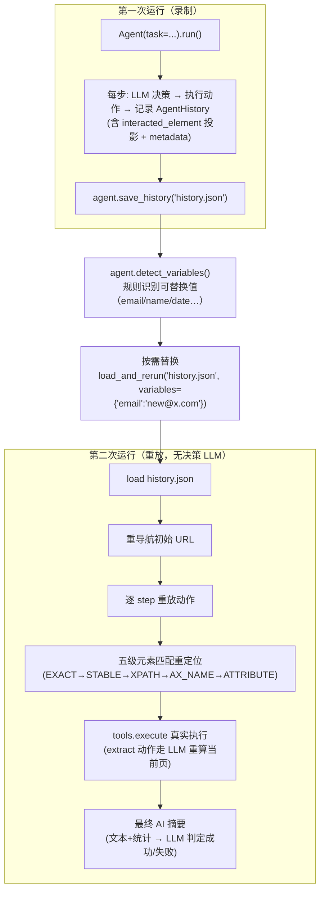

# TreeWalker 历史重放（rerun_history）技术实施方案

## 这是什么

「历史重放」把一次 Agent 运行**录制**成可持久化的历史文件，之后用**不同的数据**重放同一套动作序列——重放时**不再调用 LLM 做决策**，而是按录好的动作直接驱动浏览器。

它解决的核心问题是：**让一次昂贵的 LLM 决策成果可以被反复复用。**

> 参照实现：browser-use 的 `rerun_history`（技术分析见 `browser-use/docs/重放任务技术分析.md`，示例见 `browser-use/examples/features/rerun_history.py`）。本方案是它在 TreeWalker 上的等价落地，并针对 TreeWalker 的实际底座做了若干**简化与增强**（见下方差异速查表）。

---

## 完整工作流

---

## 适用场景

- **调试 Agent 行为**：用一致的场景复现某次运行，定位某步为何失败。
- **复用成功工作流**：把一次成功的表单填写/账号注册流程，套到不同数据上批量执行。
- **回归测试**：页面改版后，重放旧历史验证流程是否仍跑得通。
- **自动化验证**：重放后由 AI 摘要自动判定成功与否。

---

## 核心收益

| 维度 | 第一次运行（录制） | 第二次运行（重放） |
|------|--------------------|--------------------|
| LLM 决策调用 | 每步 1 次（5–30s） | **0 次** |
| 动作执行 | 真实执行 | 真实执行（相同） |
| 步间等待 | 已含在 LLM 时间里 | 受 `max_step_interval` 封顶（建议 1–5s） |
| `extract` 动作 | 含在决策里 | 仍调 LLM 重算当前页（数据变了） |
| 结尾摘要 | 无 | 1 次 LLM 调用 |

**关键结论**：重放「理论」上快得多（省掉所有决策 LLM）。实际快多少取决于 `max_step_interval`（默认 45s，可调小到 1–2s）。

---

## TreeWalker vs browser-use 差异速查

本方案**并非照搬**，而是基于 TreeWalker 已有的底座做了适配。落地时务必理解这些差异：

| 维度 | browser-use | TreeWalker（本方案） | 影响 |
|------|-------------|----------------------|------|
| **action 表示** | Pydantic union（`[{"click": {...}}]`） | 纯 dict（`{"name","params"}`） | 反序列化**无需 `output_model`**重建动作——简化 `load_from_file` |
| **`element_hash`** | `hash(node)` 随机化，跨会话不稳定 | sha256 **确定性**（`__hash__`） | EXACT 级在跨会话也有效（增强），但仍比 `stable_hash` 更易受动态类影响 |
| **`stable_hash`** | 过滤动态 CSS 类，跨会话稳定 | 同（sha256 确定性） | 重放首选 key，行为一致 |
| **extract 重算** | 单独的 `_execute_ai_step` | **直接 re-execute** `tools.execute("extract", ...)` | TreeWalker 的 `extract` 自带 LLM 且读当前页，无需额外组件（已确认 `_action_extract` 自包含） |
| **AI 摘要依据** | 截图 + 统计（视觉判定） | **纯文本 + 统计**（无截图） | `RerunSummaryAction.success` 语义从「视觉判定」改为「执行证据判定」 |
| **元素投影** | `DOMInteractedElement`（有） | `DOMInteractedElement`（**已有、未启用**） | 直接接线，无需新建 |
| **历史已有字段** | 完整（action/result/state/metadata） | 仅 `step_number/model_output/result/state_summary` | 需扩展 `AgentHistory`（见 01） |

---

## 文档索引

| 文档 | 内容 |
|------|------|
| [01-数据模型与序列化.md](01-数据模型与序列化.md) | `AgentHistory` 扩展、save/load、JSON 结构、脱敏、注册表版本号 |
| [02-录制改造.md](02-录制改造.md) | `_finalize` 投影 `interacted_element`、`save_history` 入口 |
| [03-五级元素匹配.md](03-五级元素匹配.md) | `_update_action_indices` 适配、五级降级、确定性 hash 优势、诊断 |
| [04-重放执行器.md](04-重放执行器.md) | `rerun_history` 主流程、单步执行、extract 重算、步间延迟、5 种跳过/重试、SPA |
| [05-变量检测与替换.md](05-变量检测与替换.md) | 规则版变量检测、精确整串替换、`load_and_rerun` |
| [06-AI摘要（无截图适配）.md](06-AI摘要（无截图适配）.md) | 无截图下的文本+统计判定、三层兜底、`RerunSummaryAction` |
| [07-集成入口与示例.md](07-集成入口与示例.md) | 编程 API、`examples/features/rerun_history.py`、click CLI flag、TUI 入口 |
| [08-测试与落地清单.md](08-测试与落地清单.md) | 测试策略与用例、mock 范式、实施顺序、关键陷阱清单 |

---

## 关键复用物（已存在，本方案主要是「接线」）

| 复用物 | 位置 |
|--------|------|
| `DOMInteractedElement`（含 `to_dict()`/`load_from_enhanced_dom_tree()`） | `src/tree_walker/browser/views.py:711` |
| `EnhancedDOMTreeNode.compute_stable_hash()` / `element_hash` / `xpath` | `src/tree_walker/browser/views.py:547` / `:544` / `:355` |
| `AgentHistory` / `AgentHistoryList` | `src/tree_walker/agent/views.py:79` |
| `Tools.execute(name, params, browser, browser_state)` | `src/tree_walker/tools/actions.py:379` |
| `selector_map`（按 `index` 键控，`index`===backend_node_id） | `dom_state.selector_map.get(index)` |

> 本目录是**技术实施方案文档**，不含代码改动。落地编码按 [08-测试与落地清单.md](08-测试与落地清单.md) 的顺序推进。
